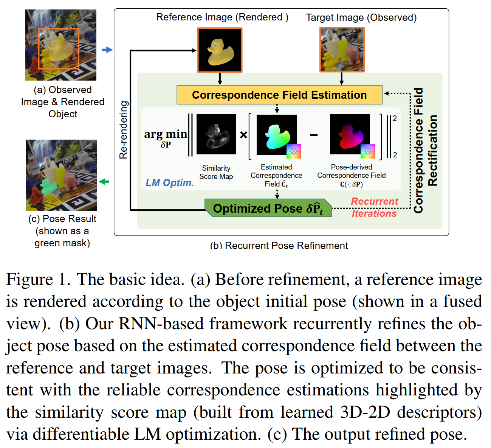

# Object Pose Estimation

- **RNNPose** Yan Xu (CUHK), RNNPose: Recurrent 6-DoF Object Pose Refinement with Robust Correspondence Field Estimation and Pose Optimization. [[CVPR 2022](https://openaccess.thecvf.com/content/CVPR2022/papers/Xu_RNNPose_Recurrent_6-DoF_Object_Pose_Refinement_With_Robust_Correspondence_Field_CVPR_2022_paper.pdf)] [[github](https://github.com/DecaYale/RNNPose)] [cite 2]

- **GPV-Pose** Yan Di (慕尼黑工大), GPV-Pose: Category-level Object Pose Estimation via Geometry-guided Point-wise Voting [[CVPR 2022](https://openaccess.thecvf.com/content/CVPR2022/papers/Di_GPV-Pose_Category-Level_Object_Pose_Estimation_via_Geometry-Guided_Point-Wise_Voting_CVPR_2022_paper.pdf)] [[github](https://github.com/lolrudy/GPV_Pose)] [cite ]

- **Gen6D** Gen6D: Generalizable Model-Free 6-DoF Object Pose Estimation from RGB Images [[arxiv 2022](https://arxiv.org/pdf/2204.10776.pdf)] [[github](https://liuyuan-pal.github.io/Gen6D/)]

- **OSOP** Ivan Shugurov (慕尼黑工大), OSOP: A Multi-Stage One Shot Object Pose Estimation Framework [[CVPR 2022](https://openaccess.thecvf.com/content/CVPR2022/papers/Shugurov_OSOP_A_Multi-Stage_One_Shot_Object_Pose_Estimation_Framework_CVPR_2022_paper.pdf)] 

- **ZebraPose** Yongzhi Su (DFKI), ZebraPose: Coarse to Fine Surface Encoding for 6DoF Object Pose Estimation. [[CVPR 2022](https://openaccess.thecvf.com/content/CVPR2022/papers/Su_ZebraPose_Coarse_To_Fine_Surface_Encoding_for_6DoF_Object_Pose_CVPR_2022_paper.pdf)] [[github]( https://github.com/suyz526/ZebraPose)] [cite 1]

- **FS6D** Yisheng He (HKUST & 旷视), FS6D: Few-Shot 6D Pose Estimation of Novel Objects. [[CVPR 2022](https://openaccess.thecvf.com/content/CVPR2022/papers/He_FS6D_Few-Shot_6D_Pose_Estimation_of_Novel_Objects_CVPR_2022_paper.pdf)] [[github](https://fs6d.github.io/)] [cite 1]

- **UDA-COPE** Taeyeop Lee (KAIST), UDA-COPE: Unsupervised Domain Adaptation for Category-level Object Pose Estimation. [[CVPR 2022](https://openaccess.thecvf.com/content/CVPR2022/papers/Lee_UDA-COPE_Unsupervised_Domain_Adaptation_for_Category-Level_Object_Pose_Estimation_CVPR_2022_paper.pdf)] [cite 1]

- **SurfEmb** SurfEmb: Dense and Continuous Correspondence Distributions
for Object Pose Estimation with Learnt Surface Embeddings. [[CVPR 2022](https://openaccess.thecvf.com/content/CVPR2022/papers/Haugaard_SurfEmb_Dense_and_Continuous_Correspondence_Distributions_for_Object_Pose_Estimation_CVPR_2022_paper.pdf)] [[github](https://surfemb.github.io/)] [cite 3]

- **TemplatePose** Van Nguyen Nguyen (CNRS, France), Templates for 3D Object Pose Estimation Revisited: Generalization to New Objects and Robustness to Occlusions. [[CVPR 2022](https://openaccess.thecvf.com/content/CVPR2022/papers/Nguyen_Templates_for_3D_Object_Pose_Estimation_Revisited_Generalization_to_New_CVPR_2022_paper.pdf)] [[github](https://github.com/nv-nguyen/template-pose)] [cite 2]

- **DualPoseNet** Jiehong Lin,...,Kui Jia, (华南理工 & 华为), DualPoseNet: Category-level 6D Object Pose and Size Estimation
Using Dual Pose Network with Refined Learning of Pose Consistency. [[ICCV 2021](http://openaccess.thecvf.com/content/ICCV2021/papers/Lin_DualPoseNet_Category-Level_6D_Object_Pose_and_Size_Estimation_Using_Dual_ICCV_2021_paper.pdf)] [[github]()] [cite 17]

- **KDFNet** Xingyu Liu (CMU), KDFNet: Learning Keypoint Distance Field for 6D Object Pose Estimation. [[IROS 2021](https://arxiv.org/pdf/2109.10127)] [cite 1]

- **CenterSnap** Muhammad Zubair Irshad (乔治亚理工 & 丰田研究院), CenterSnap: Single-Shot Multi-Object 3D Shape Reconstruction and Categorical 6D Pose and Size Estimation. [[ICRA 2022](https://arxiv.org/pdf/2203.01929)] [[github](https://github.com/zubair-irshad/CenterSnap)] [cite 2]

- **YOLOPose** YOLOPose: Transformer-based Multi-Object 6D Pose Estimation using Keypoint Regression. [[arxiv 2022](https://arxiv.org/pdf/2205.02536)]

- **OnePose** Jiaming Sun (浙大&商汤), OnePose: One-Shot Object Pose Estimation without CAD Models. [[CVPR 2022](https://openaccess.thecvf.com/content/CVPR2022/papers/Sun_OnePose_One-Shot_Object_Pose_Estimation_Without_CAD_Models_CVPR_2022_paper.pdf)] [[github](https://zju3dv.github.io/onepose/)] 

    - 扩展篇OnePose++: Keypoint-Free One-Shot Object Pose
Estimation without CAD Models. [[arxiv 2023](https://arxiv.org/pdf/2301.07673.pdf)]

- **`TemporalFusion`** Fengjun Mu (中科大), TemporalFusion: Temporal Motion Reasoning with Multi-Frame Fusion for 6D Object Pose Estimation. [[IROS 2021](https://ieeexplore.ieee.org/stamp/stamp.jsp?tp=&arnumber=9636583)] [[github](https://github.com/mufengjun260/TemporalFusion21)] [cite 0]

- **`TemporalFusion扩展`** Rui Huang (中科大), Estimating 6D Object Poses with Temporal Motion Reasoning for Robot Grasping in Cluttered Scenes. [[RAL 2022](https://ieeexplore.ieee.org/abstract/document/9699040/)] [[github](https://github.com/mufengjun260/H-MPose)] [cite 0]

- **Morefusion** Kentaro Wada (帝国理工), Morefusion: Multi-object reasoning for 6d pose estimation from volumetric fusion, [[CVPR 2020](https://openaccess.thecvf.com/content_CVPR_2020/papers/Wada_MoreFusion_Multi-object_Reasoning_for_6D_Pose_Estimation_from_Volumetric_Fusion_CVPR_2020_paper.pdf)] [cite 48]

- **Cosypose** Cosypose: Consistent multi-view multi-object 6d pose estimation. [[ECCV 2020](https://arxiv.org/pdf/2008.08465)] [[page](https://www.di.ens.fr/willow/research/cosypose/)] [cite 133]

- **Latentfusion** Latentfusion: End-to-end differentiable reconstruction and rendering for unseen object pose estimation. [[CVPR 2020](https://openaccess.thecvf.com/content_CVPR_2020/papers/Park_LatentFusion_End-to-End_Differentiable_Reconstruction_and_Rendering_for_Unseen_Object_Pose_CVPR_2020_paper.pdf)] [[github](https://keunhong.com/publications/latentfusion/)] [cite 54]

- TCLCH, Real-Time Monocular Pose Estimation of 3D Objects using
Temporally Consistent Local Color Histograms. [[ICCV 2017](https://openaccess.thecvf.com/content_ICCV_2017/papers/Tjaden_Real-Time_Monocular_Pose_ICCV_2017_paper.pdf)] [cite 90]
（RBOT的三篇论文之一）

- Neural Object Fitting - Category level object pose estimation via neural analysis-by-synthesis. [[ECCV 2020](https://arxiv.org/pdf/2008.08145)] [cite 46]

- **RLLG** Ming Cai (阿德莱德大学), Reconstruct locally, localize globally: A model free method for object pose estimation. [[CVPR 2020](https://openaccess.thecvf.com/content_CVPR_2020/papers/Cai_Reconstruct_Locally_Localize_Globally_A_Model_Free_Method_for_Object_CVPR_2020_paper.pdf)] [cite 9]

- Objectron: A large scale dataset of object-centric videos in the wild with pose
annotations. [[CVPR 2021](https://openaccess.thecvf.com/content/CVPR2021/papers/Ahmadyan_Objectron_A_Large_Scale_Dataset_of_Object-Centric_Videos_in_the_CVPR_2021_paper.pdf)] [cite 45]

- **SGPA**: Kai Chen, Qi Dou (CUHK), Structure-Guided Prior Adaptation for
Category-Level 6D Object Pose Estimation. [[ICCV 2021](https://openaccess.thecvf.com/content/ICCV2021/papers/Chen_SGPA_Structure-Guided_Prior_Adaptation_for_Category-Level_6D_Object_Pose_Estimation_ICCV_2021_paper.pdf)] [[page](https://www.cse.cuhk.edu.hk/˜kaichen/projects/sgpa/sgpa.html)] [cite 14]

- **PPR-Net** Zhikai Dong (商汤&清华), PPR-Net:Point-wise Pose Regression Network for Instance Segmentation and 6D Pose Estimation in Bin-picking Scenarios. [[IROS 2019](https://ieeexplore.ieee.org/abstract/document/8967895/)] [[github](https://github.com/lvwj19/PPR-Net-plus)] [cite 26]

- **OLD-Net** Zhaoxin Fan (人大), Object level depth reconstruction for category level 6d object pose estimation from monocular RGB image. [[ECCV 2022](https://arxiv.org/pdf/2204.01586.pdf)] [[github]()] [cite 6]

    

    
 补注 

    输入RGB，同时预测**物体级深度图**和NOCS表示，并将两者对齐(umeyama)得到物体Pose！具体做法暂略，另外一个可以用来预测深度的工具是：arxiv2022_GCVD_Globally Consistent Video Depth and Pose Estimation。
    

- **NeRF-Pose** Fu Li (国防科大&TUM), Nerf-pose: A first-reconstruct-then-regress approach for weakly-supervised 6d object pose estimation. [[arxiv 2022](https://arxiv.org/pdf/2203.04802.pdf)] [cite 8]

- **VideoPose** Apoorva Beedu (佐治亚理工), VideoPose: Estimating 6D object pose from videos. [[arxiv 2021](https://arxiv.org/abs/2111.10677)]

- **CenterPose** Yunzhi Lin (佐治亚理工), Single-Stage Keypoint-Based Category-Level
Object Pose Estimation from an RGB Image. [[arxiv 2021](https://arxiv.org/abs/2111.10677)]

    

    
 姊妹篇：CenterPoseTrack 

    [CenterPoseTrack](https://ieeexplore.ieee.org/stamp/stamp.jsp?arnumber=9811720&casa_token=jl6si6ZQoFEAAAAA:bXXs-DU7uhCrkHNO_vAHUCePwNRSUJEFvZymA_6eO_jZdh6LTVx2n4Z0vUUIt4pnGTiEv4cAAk_q)：Keypoint-Based Category-Level Object Pose Tracking from an RGB Sequence with Uncertainty Estimation. (基于CenterPose网络，补充贝叶斯滤波和卡尔曼滤波，具体暂跳过)
    

- **TexPose** Hanzhi Chen (TUM), TexPose: Neural Texture Learning for Self-Supervised 6D Object Pose Estimation. [[arxiv 2022](https://arxiv.org/pdf/2212.12902.pdf)]

## Others

- **UniPose** Bruno Artacho (RIT), UniPose: Unified Human Pose Estimation in Single Images and Videos. [[CVPR 2020](https://openaccess.thecvf.com/content_CVPR_2020/papers/Artacho_UniPose_Unified_Human_Pose_Estimation_in_Single_Images_and_Videos_CVPR_2020_paper.pdf)] [cite 78]

- **MaskFusion** Martin Runz (伦敦学院大学), MaskFusion: Real-Time Recognition, Tracking and Reconstruction of Multiple Moving Objects. [[ISMAR 2018](https://arxiv.org/pdf/1804.09194)] [[page](http://visual.cs.ucl.ac.uk/pubs/maskfusion/)] [cite 207]
    
    物体级的语义动态SLAM-也许能用到它的物体3D重构。

- **POMNet** Pose for Everything: Towards **C**ategory-**A**gnostic **P**ose **E**stimation. [[ECCV 2022]()] [[github](https://github.com/luminxu/Pose-for-Everything)] [cite ]

    关键词：**小样本设置** (metric-learning based)；2D关键点检测; transformer-based.（注：标题中pose其实指关键点）

    

    
 相关评述 

    1.对比：作者称最相关的是[StarMap (ECCV 2018)](https://openaccess.thecvf.com/content_ECCV_2018/papers/Xingyi_Zhou_Category-Agnostic_Semantic_Keypoint_ECCV_2018_paper.pdf)，因为都是关注类别无关的关键点！只不过StarMap要用到3D CAD model并标注3D关键点，而本文是关注2D关键点。

    2.概述StarMap：StarMap即单通道heatmap，可得所有关键点的2D像素坐标，同时预测DepthMap和CanViewFeature，分别得各像素对应的depth值，和canonical标准物体坐标系下的3D坐标；2D像素和标准3D坐标可以直接PnP，文中是2D像素+depth先恢复到cam下的3D坐标，再和标准3D坐标得物体6D pose！——> **自评**：其实这不就是CVPR'19_**NOCS**了嚒！只不过StarMap是focus关键点，而NOCS是对物体所有可见像素，且NOCS的depth是传感器值而非预测值！另外，ICCV'19_**Pix2Pose**也是预测像素的标注3D坐标，与NOCS如出一辙，只不过它暂只关注了instance-level！

    

- **--** [[CVPR ]()] [[github]()] [cite ]

## Pose Tracking

- **TP-AE** Linfang Zheng (南方科大 & 英国伯明翰大学), TP-AE: Temporally Primed 6D Object Pose Tracking with Auto-Encoders. [[ICRA 2022](https://research.birmingham.ac.uk/files/164770788/_ICRA_TP_AE_6D_Object_Tracking.pdf)] [[github](https://github.com/Lynne-Zheng-Linfang/TP-AE_Object_tracking)] [cite ] 

- **ROFT** ROFT: Real-Time Optical Flow-Aided 6D Object Pose and Velocity Tracking. [[arxiv 2021]()] [[github]()] [cite ]

## Object-level SLAM

- **suo-slam** Nathaniel Merrill (特拉华大学&TUM), **S**ymmetry and **U**ncertainty-Aware **O**bject **SLAM** for 6DoF Object Pose Estimation. [[CVPR 2022](https://openaccess.thecvf.com/content/CVPR2022/papers/Merrill_Symmetry_and_Uncertainty-Aware_Object_SLAM_for_6DoF_Object_Pose_Estimation_CVPR_2022_paper.pdf)] [[github](https://github.com/rpng/suo_slam)] [cite 6]

- - -

## Paper notes

 <b> RNNPose (CVPR 2022) - 迭代pose refine </b> 

- 需要提供物体的CAD模型，和初始的pose；注意它的目的是做pose refinement!
- 对我而言，它的优点是较好地将RAFT框架和pose微调任务结合起来了，并且利用了render和非线性优化技术得到end2end模型，以及明确了光流场和3D刚体变换之间的关系(Eq.1)；缺点是，如作者本人所言，该模型是object-specific，对于novel object, pose refinement module需要进一步被微调！

- 摘要：本文提出一种方法，从**单目图像**中估计物体的6-Dof位姿，采用了基于RNN的框架，能较鲁棒地应对erroneous初始pose和遮挡问题。在循环迭代中，基于估计的匹配场（correspondence field），物体的pose优化被建模为非线性最小二乘问题，然后基于可微的LM优化算法求解，可实现端到端训练，其中，匹配场的估计和位姿优化这两个步骤是交替进行的。在LINEMOD，Occlusion-LINEMOD和YCB-Video上达到了SOTA效果。

- 算法架构：3D model表示成从各个角度渲染的2D query template的集合。
    

- 详细框架：其中render是基于pytorch3d；render包括将3D model根据init_pose渲染为图片，还有将3D features渲染为2D context feature map。

 <b> GPV-Pose (CVPR 2022) - 冗余预测：R/t/s回归 + bbox投票 </b> 

1. 虽然自称是depth-based的方法，但实际上也是要用rgb图片，用比如maskRCNN处理rgb图得到目标物体的mask，然后结合depth图得到物体对应的点云！实验对比说是优于DualPoseNet，并且是一个模型训练所有类别？！
2. 自以为，该方法的核心是进行**冗余预测**，包括直接回归出R,t和s得到pose，和预测逐点到bbox的6个面的方向和距离，投票出bbox的位置朝向大小从而得到pose；除了预测Pose，还搞了个重构分支，反正它们提取特征的backbone是共享的，故宣称这样做利于特征的学习！
3. 然后加了2个几何约束，一个约束思路和建模都比较直观，比如对于旋转分量，就是让回归分支预测的rx和ry，跟bbox投票分支得到的平面法向一致，对于平移分量，就是利用点法线公式，构建bbox平面到原点距离，跟bbox的size之间的关系！另一个约束的思路还算直观，但是建模太tricky，暂略；
- 摘要：利用几何信息来增强类别级pose估计的特征学习，一者引入解耦的置信度驱动的旋转表达，二来提出几何引导的逐点投票进行3D bbox估计。最后，利用不同的输出流，加入几何一致性约束，可以进一步提升性能。GPV-Pose的推理速度能达到20FPS。

- 网络结构：下面$r_x$和$r_y$是平面法向；预测的残差平移，通过加上输入点云的均值，得到最终的平移量；预测的残差size，通过加上预先计算的类均值size，得到最终的size；对称考虑镜像对称和旋转对称；对于逐点bbox投票，给每个点预测它到每个面的方向，距离和置信度，因此每个点要预测的维度就是$(3+1+1)\times 6 = 30$；置信度感知的损失函数（论文中Eq.(1)和Eq.(6)有点意思）。
    

 <b> Gen6D (arxiv 2022) - 小样本：学好特征 </b> 

- 摘要：Existing generalizable pose estimators either need the high-quality object models or require additional depth maps or object masks in test time, which significantly limits their
application scope. In contrast, our pose estimator only requires some posed images of the unseen object and is able to accurately predict poses of the object in arbitrary environments. Gen6D consists of an object detector, a viewpoint selector and a pose refiner, all of which do not require
the 3D object model and can generalize to unseen objects. 

- 作者argue一个pose估计器应该具有的性质包括：1) 泛化性，指泛化到任何物体；2) model-free；3) simple-inputs,只须输入rgb，无需物体mask或depth map。考虑到基于回归的旋转和平移预测，受限于特定的实例或者类别，无法泛化到任意未见物体；并且，由于缺乏3D model，无法构建2D-3D匹配，因此基于PnP的方法也不能用，因此作者采用基于图像匹配的方式，进行coarse-to-fine的pose估计。

- 网络结构：模型输入是一张query image，和一堆reference image，并且参考图像中的物体pose是已知的，感觉这个要求也不实用啊？！文中说的是："Given Nr images of an object with known camera poses"，搞不清到底是已知谁的pose；另外Data normalization中提到利用三角化来估计物体的size，存疑，三角化不是存在尺度不确定性问题嚒？！

- 大致流程：基于correlation的object location，定位出query图片中的物体位置，得出大致的平移分量；然后基于网络学习相似性度量，挑选ref图像中view最接近的图像，结合预测的in-plane rotation得粗糙的旋转分量；最后pose refiner利用3D CNN和transformer的特征信息融合方式，进行输出微调。

- **这个应该是Few-shot setting，相当于通过少量标注样本，就可以泛化到该instance，另参FS6D**。虽然无须3DCAD model, depth和mask信息，但要提供一些ref图片！

    
    

 <b> OSOP (CVPR 2022) </b> - 小样本 

- 输入RGB + 3D CAD model；2D-2D匹配 + 2D-3D匹配（PnP with RANSAC）；
- 摘要：We present a novel **one-shot** method for object detection and 6 DoF pose estimation, that does not require training on target objects. At test time, it **takes as input a target image and a textured 3D query model**. The core idea is to represent a 3D model with a number of 2D templates rendered from different viewpoints. This enables CNN-based direct dense feature extraction and matching. The object is
first localized in 2D, then its approximate viewpoint is estimated, followed by dense 2D-3D correspondence prediction. The final pose is computed with PnP. We evaluate the method on LineMOD, Occlusion, Homebrewed, YCB-V and TLESS datasets.

- 网络结构
    

- 注：**Kabsch算法**：A solution for the best rotation to relate two sets of vectors（1976）；在"点云累积"论文ECCV2022_Dynamic 3D Scene Analysis by Point Cloud Accumulation的Eq.(3)中也用到了，看上去是带权的最小二乘问题。

 <b> ZebraPose (CVPR 2022) </b> 

- 摘要：we present a discrete descriptor, which can represent the object surface
densely. By incorporating a hierarchical binary grouping, we can encode the object surface very efficiently. Moreover,
we propose a coarse to fine training strategy, which enables fine-grained correspondence prediction. Finally, by matching predicted codes with object surface and using a PnP solver, we estimate the 6DoF pose. **In summary, we propose ZebraPose, a two-stage RGBbased approach that defines the matching of dense 2D-3D correspondence as a hierarchical classification task**.

- Surface encoding：以简单情形为例：编码长度为$d$，即对object的顶点进行$d$次分组（提到用kmeans），每一次迭代分组，每个顶点都被赋一个类别id（binary取值），最后把$d$个类id堆叠起来就是顶点的code，可知一个group内的顶点共享code。对于每个3D model，都建立这样的表达并存储起来。

- 网络结构：自大致理解，基于网络预测像素的code，然后跟3D model预先建立的顶点code进行比较，即可构建2D-3D的匹配关系，然后PnP求解pose。
    
    

 <b> FS6D (CVPR 2022) - 小样本：学好特征 </b> 

- 没有太大意思，RGBD input，基于FFB6D的特征提取网络，加上transformer进行特征增强，构建support view和query之间的匹配关系，论文废话有点多，部分细节没说清楚，自分析应该是能得到depth point之间的匹配关系，然后利用Umeyama算法即得query相对于support的delta pose，再根据support的pose恢复出query的Pose。噢，还搞了一个PBR类型的rgbd数据集。

- 摘要：We study a new open set problem; the few-shot 6D object poses estimation: estimating the 6D pose of an unknown object by a few support views without extra training. We propose a dense prototypes matching framework by extracting and matching dense RGBD prototypes with transformers. We propose a large-scale RGBD photorealistic dataset (ShapeNet6D) for network pre-training.

- 网络结构
    
    

 <b> UDA-COPE (CVPR 2022) </b> 

- 是第一个对基于RGBD的类级别物体姿态估计做无监督域适应的工作；
- 摘要：The proposed method exploits
a teacher-student self-supervised learning scheme to train a pose estimation network without using target domain pose labels. We also introduce a bidirectional filtering method between the predicted normalized object coordinate space (NOCS) map and observed point cloud, to not only make
our teacher network more robust to the target domain but also to provide more reliable pseudo labels for the student network training.

- 网络结构：(1) 先在合成数据上对教师网络进行有监督训练，再在真实数据上进行无监督域适应；(2) Fig.1是Fig.2中model的网络结构，注意2D特征是与点云有效匹配的特征，是从特征图中采样（4.1节提到把图像块resize为192x192的大小，再随机采样1024个点，应该是指对应这些点的2D特征）；(3) 为了让合成数据上训练的教师网络，在真实数据上的预测更好，即学生网络的伪标签更好，提出Fig.3所示的双向点滤波，看上去比较简单，就是基于老师网络的初始预测，将depth点云对齐到NOCS map，然后计算对齐后二者的逐点距离，设定阈值，分别从两个方向上过滤掉距离值大的异常点；(4) 联合训练老师网络和学生网络，具体地，利用过滤后的NOCS图作为学生网络的伪标签；同时，老师网络基于自监督开始学习真实数据上的知识，作者提出利用几何一致性，通过交叉熵损失，约束过滤后的对齐点云（可能只是原始点云的一个很小子集）要和老师网络自己预测的NOCS图一致！
    
    

 <b> TemplatePose (CVPR 2022) </b> 

- 关键词：Model-based；图像匹配；泛化到长的很不一样的物体上。
- 摘要：Our method requires neither a training phase on these objects nor real images depicting them, only their CAD models. It relies on a small set of training objects to learn local object representations, which allow us to locally match the input image to a set of “templates”, rendered images of the CAD models for the new objects. As a result, we are the first to show generalization without retraining on the LINEMOD and
Occlusion-LINEMOD datasets.

- 网络结构
    
    

 <b> SurfEmb (CVPR 2022) </b> 

- 关键词：基于对比学习，构建2D-3D稠密匹配。

- 摘要：We present an approach to learn dense, continuous 2D-3D correspondence distributions over the surface of objects. We also present a new method for 6D pose estimation of rigid objects using the learnt distributions to sample, score and refine pose hypotheses. The correspondence distributions are learnt with a contrastive loss.

- Overview: We base our method on image crops from a detection model. We feed an image crop through our model to obtain dense (pixelwise) surface distributions and a mask which together form a correspondence distribution. In a PnP-RANSAC fashion, we sample pose hypotheses from the correspondence distribution and score each hypothesis based on the mask and surface distributions. The best scoring pose hypothesis is then refined based on the surface distributions to obtain the final pose estimate.

- 算法流程：四阶段方法：检测物体，从crop图中学习分布，从分布中得到初始pose，refinement。
    

 <b> DualPoseNet (ICCV 2021) - 冗余预测：R/t/s回归 + NOCS回归 </b> 

- 核心：同时使用“直接pose回归”和“NOCS坐标预测”两种pose估计方案。

- 摘要：DualPoseNet stacks two parallel pose decoders on top of a shared pose encoder. The implicit and explicit decoders thus impose complementary supervision on the training of pose encoder. We construct the encoder
based on spherical convolutions, and design Spherical Fusion wherein for a better embedding of pose sensitive features from the appearance and shape observations.

- 网络结构
    

- Refinement：在测试阶段，共有3种方式可以得到pose参数：(1)直接从explicit decoder的结果中得到pose参数；(2)从implicit decoder中得到NOCS坐标预测，然后Umeyama算法求解pose参数；(3) refinement。这里介绍第三种refine的方式，它是利用2个decoder的预测结果的几何一致性作为Loss，即输入点云P经过显式预测的R|T|s变换后得到的标准坐标，要和隐式预测的标准坐标一致，在测试阶段，固定两个decoder网络参数，并单独优化encoder。
    

 <b> KDFNet (IROS 2021) - 基于距离场的2D关键点投票 </b> 

- 关键词：Model-based；RGB input；关键点距离场；PnP；
- 要解决：基于pixel-wise voting的方法是direction-based，即每个像素预测它到关键点的2D方向；该方法有一个前提假设，投票方向之间的夹角要足够大，因此该假设不适用于细长的物体，为此，本文提出KDF。
- 本文的3D关键点，follow PVNet是基于FPS采样得到！本文的voting，是先采样一堆像素(voters)，然后每3个为一组，两两组合可以预测3个关键点位置候选，这样重复N次，得3N个候选，然后基于RANSAC思路，对每个候选，让所有voters对它投票，最后取score最高的候选作为最终预测！关于metric，除了常规的ADD accuracy和ADD AUC，还有2D projection accuracy（以偏差5个像素为阈值）。
- 摘自引言：主要有2类方法来定位2D keypoints，包括heatmap-based 和 voting-based，且后者对于遮挡情况更加鲁棒！
- 摘要：We propose a novel continuous representation called Keypoint Distance Field
(KDF) for projected 2D keypoint locations. Formulated as a 2D array, each element of the KDF stores the 2D Euclidean distance between the corresponding image pixel and a specified
projected 2D keypoint. We use a fully convolutional neural network to regress the KDF for each keypoint.

- 网络结构
    
    

 <b> CenterSnap (ICRA 2022) - center系单阶段！AE形状重建 </b> 

- 要解决：现有的基于“标准坐标回归”和“直接pose回归”方案，计算量大，并且在复杂的多目标场景中性能不好。Existing approaches mainly follow a complex multi-stage pipeline which first localizes and detects each object instance in the image and then regresses to either their 3D meshes or 6D poses. These approaches suffer from high-computational cost and low performance in complex multi-object scenarios, where occlusions can be present. 

- 摘要：同时进行多目标3D重建和基于单视图RGB-D的pose估计，参考CenterNet将目标表示为点。 This paper studies the complex task of simultaneous multi-object 3D reconstruction, 6D pose and size estimation from a single-view RGB-D observation. Our method treats object instances as spatial centers where each center denotes the complete shape of an object along with its 6D pose and size.

- 单阶段和两阶段框架对比
    
- 网络结构：
  1. 直接输入RGB-D图片，提取多尺度FPN特征。这里直接resnet处理depth图好像不太常见！
  2. FPN特征分别输入2个head网络，其中heatmap head用于定位物体的center，param head用于输出全部3D信息，包括shape的128维latent code，和13维的Pose信息（即9维R，3维t，1维s），至于3维的size，可以从latent code重建的标准化的物体点云的bbox获取到，再乘以scale缩放到原来尺寸！
  3. shape的latent code的ground truth，是通过自编码器AE预先训练学习的！
    

 <b> TemporalFusion (IROS 2021) -- 时序特征融合！ </b> 

- 自评：1.该工作是model-based而非类别级；2. 时序融合的方式还是太粗糙，直接concat，不过好歹避免了对齐问题（FaF中直接concat特征图会引入对不齐的问题）；3. 实验方面仅仅对比了DenseFusion。

- 摘要：we present an end-to-end model named TemporalFusion, which integrates the temporal motion information from RGB-D images for 6D object pose estimation. The core of proposed TemporalFusion model is to embed and fuse the temporal motion information from multi-frame RGBD sequences, which could handle heavy occlusion in robotic grasping tasks. Furthermore, the proposed deep model can also obtain stable pose sequences, which is essential for realtime robotic grasping tasks. We evaluated the proposed method in the YCB-Video dataset.

- 网络结构：
    - (1) 语义分割得目标mask，其rgb和depth分别由PSPNet和Pointnet提特征；不同于DenseFusion，作者提出基于采样的特征融合，对于第$i$帧，采样$N*\alpha_i$个点，其中$\sum_{i=1}^t \alpha_i = 1$，于是t帧数据融合总共就有N个点，特征维度256；图中展示的效果是，对于远离当前帧的早期帧，采样点可以相对少一些；
    - (2) 运动推理：基于Open3D的视觉里程计算出位姿变化（这部分待续）；
    - (3) 时序融合：基于全局池化和最大池化，获取全局特征；用两个3-layer的卷积网络，将运动推理模块预测的$R'$和$T'$分别转化为运动特征；再结合N个逐点特征（局部），全部堆叠起来得融合的时序特征；
    - (4) 考虑到不同特征对最终的pose估计贡献不同，采用CBAM注意力给特征的通道加权，然后接3个head分别预测$R$, $T$和置信度$c$，取置信度最大的$c$对应的预测作为最终结果。
    
    

 <b> YOLOPose (arxiv 2022)  </b> 

- **摘要**：We propose YOLOPose, a **Transformer-based multi-object monocular 6D pose estimation** method based on **keypoint regression**. In contrast to the standard heatmaps for predicting keypoints in an image, we directly regress the keypoints.  Additionally, we employ a learnable orientation estimation module to predict the orientation from the keypoints. Our model is **end-to-end** differentiable and is suitable for **real-time** applications. ...test on the YCBVideo dataset.

- 注：32 keypoints (the eight corners of the 3D bounding box and the 24 intermediate bounding box keypoints)

- **示意图**
    

- **网络结构**
    

 <b> OnePose (CVPR 2022) - SFM重建 + 转为相机定位任务  </b> 

- **OnePose**：One-shot之意！因涉及重建，自然model-free，要现成的2D检测器提供bbox！
- **思路**：基于传统的定位pipeline来做物体pose任务，即“offline mapping + online localization”，mapping就是要先给定一段物体的video scan，利用SFM进行稀疏物体点云重建（物体点云看作不动的scene）；localization就是对于query img，通过特征匹配，获取相机的pose，注意这个pose是相机相对于scene的，这里也即相对于物体的，所以相机pose的逆，就是最终要求的物体的pose！关于特征匹配，传统是2D到2D，作者提出3D-2D，即先把ref video frame中的2D特征点的描述子，基于注意力聚合为对应的3D地图点的描述子，然后基于描述子，匹配3D地图点和query img中的2D特征点，有了匹配，就可以通过RANSAC PNP求解位姿！
- **其他**: 论文中是基于ARKit/ARCore工具标注出物体的bbox（相当于指定标准的物体坐标系）和每帧的相机位姿，拍摄ref video时假设物体竖直放置于平面，且保持静止，故bbox限于绕竖直的z轴旋转；OnePose的位姿估计模块仅处理关键帧，所以还有位姿tracking模块处理每一帧，这部分在补充材料中，暂略~
- **缺点**：如作者所言，依赖于局部特征匹配（特征如SIFT, SuperPoint，匹配器如最近邻，SuperGlue），匹配限于3D bbox内的重建点云，和query img上的2D bbox内的特征点，所以对于低纹理的物体可能失败，当训练和测试的seq差异太大时，也可能失败！
- **扩展**: 作者自行扩展了OnePose++，丢掉了基于关键点+描述子的匹配策略！提升了处理低纹理物体的能力！具体内容暂略。

- **摘要**：OnePose draws the idea from visual localization and only requires a simple RGB video scan of the object to build a sparse SfM model of the object. We propose a new graph attention network that directly matches 2D interest points in the query image with the 3D points in the SfM model, resulting in efficient and robust pose estimation. ...run in real-time. ... test on self-collected dataset that consists of 450 sequences of 150 objects.

- 关注related works章节；摘录对NOCS系列方法的评价： A limitation of this line of work is that the shape and the appearance of some instances could vary significantly even they belong to the same category, thus the generalization capabilities of trained networks over these instances are questionable. Moreover, accurate CAD models are still required
for ground-truth NOCS map generation during training, and different networks need to be trained for different categories. 总结就是NOCS只是测试阶段不需要CAD models，训练阶段仍需要，因此在本文中仍被划分为Model-Based方法。

- **对比各种设置的示意图**
    

- **算法流程**
    

 <b> Morefusion (CVPR 2020)  </b> 

- 处理known objects
- **摘要**：We present a system which can estimate the accurate poses of multiple **known objects** in contact and occlusion from real-time, embodied multi-view vision. Our approach makes 3D object pose proposals from single RGBD views, accumulates pose estimates and non-parametric occupancy information from multiple views as the camera moves, and performs joint optimization to estimate consistent, non-intersecting poses for multiple objects in contact. ...test on YCB-Video, and our own challenging Cluttered YCB-Video.

- **pipiline的四个阶段**：
    - object-level volumetric fusion: 用目标实例的mask处理RGB+depth，再结合相机位姿的tracking(基于ORB-SLAM2)，创建一个volumetric map(包括已知的目标和未知的目标)；
    - volumetric pose prediction： 利用volumetric map作为目标周围的信息，结合目标经mask后的特征grid，估计一个初始的位姿；
    - collision-based pose refinement：使用物体CAD模型上的采样点(经估计的pose转换)，和volumatric map上的occupied space进行碰撞检查，通过梯度下降联合优化多个目标的位姿；
    - CAD alignment：将多个相机坐标系下估计的目标物体pose，转换到统一的世界坐标系下，然后两两计算pose loss一并优化，使各视角下预测的pose是一致的。

- **网络结构**
    

- **子网络结构**
    

 <b> Cosypose (ECCV 2020) - 物体级场景重建 </b> 

- Cosy是consistency之意！处理包含known objects的scene，即物体的3D CAD模型已知；算法输入是多视图的img；第一阶段，先按单目的方式去检测物体并估计其pose；第二阶段，参见Fig.5，对任意2个view的img pair，挑2组object pair，并根据object pose得到这2个view的cam delta pose(基于RANSAC丢掉不靠谱的cam pose预测，也即丢掉了不靠谱的object pair：对应标签一致但不是同一个实例)；然后就可以构建graph，其中顶点是object，边连接构成pair的object，于是graph中的一个连通分量就对应了同一个object实例！第三阶段，构建object-level的BA优化问题，扫了一眼代码，应该是直接手写前向雅可比，及LM优化步骤的，未用到优化库。
- 优点：将单目物体pose估计，融合到多视图优化框架下！能同时得到object-level的scene重建，各物体的pose，以及各view的相机pose；缺点：自分析，根据第二阶段的相对相机pose的计算，CosyPose应该只能处理静态场景！

- **摘要**：We introduce an approach for recovering the 6D pose of multiple known objects in a scene captured by a set of input images with unknown camera viewpoints. (1) We present a **single-view single-object** 6D pose estimation method to generate pose hypotheses; (2) We **jointly estimate** camera viewpoints and 6D poses of all objects in a single consistent scene; (3) We develop a method for global scene refinement by solving an **object-level bundle adjustment** problem. ... test on YCB-Video and T-LESS datasets.

- **示意图**
    

- **算法流程**
    

- 第二阶段计算相机delta pose的图示
    

 <b> Latentfusion (CVPR 2020) - 小样本：重建+渲染 </b> 

- 处理unseen objects；render-and-compare；
- **摘要**：We present a network that reconstructs a latent 3D representation of an object using a small number of reference views at inference time. Our network is able to render the latent 3D representation from arbitrary views. Using this neural renderer, we directly optimize for pose given an input image. By training our network with a large number of 3D shapes for **reconstruction and rendering**, our network generalizes well to **unseen objects**. We present a new dataset for unseen object pose estimation–**MOPED**. ...test on MOPED as well as the ModelNet and LINEMOD datasets.

- **重建+渲染用于位姿估计**
    1. **重建**：这里是指在latent space中的重建！给定一些reference RGB-D图片，利用modeler构建latent object，其实就是先用2D UNet提特征，然后lift到3D grid中，再3D UNet继续提特征，简单理解，正常3D空间中的一个点只有3维坐标信息，现在扩展成了C维的特征向量！每个视图view下都能构建一个latent object，它们分别处于各自的cam坐标系下，可以转到obj坐标系下，这样就能整合成唯一的latent object，这里可以通过channel-wise的均值池化，论文中是采用RNN的方式融合！
    2. **渲染**：简单把它看作上述重建的逆过程，也是通过3D/2D的UNet进行特征处理，最后输出depth和mask图；因为rgb图中的高频信息不太容易由NN去学习，所以论文采用了**Image-based Rendering(IBR)**技术，单独得到rgb图。简单来说，query的像素点，根据cam内参及query和ref的pose，可以找到各个ref图像上匹配像素，取这些匹配像素的rgb进行blend就得到了query的rgb值！
    3. **位姿估计**：利用重建网络的modeler处理ref图，获取latent object，然后用渲染网络，在给定的init_pose下，渲染得到对应的depth和mask图，基于若干loss进行梯度反传，直接优化pose参数！
    

- **重建+渲染的网络结构**
    

 <b> RLLG (CVPR 2020)  </b> 

- **摘要**：We propose a learning-based method whose input is a collection of images of a target object, and whose output is the pose of the object in a novel view. At inference time, our method maps from the RoI features of the input image
to a dense collection of object-centric 3D coordinates, one per pixel. This dense 2D-3D mapping is then used to determine 6dof pose using standard PnP plus RANSAC. We seamlessly build our model upon Mask R-CNN. We contribute a new head – the object coordinate head – to the same backbone, whose output is the dense 3D coordinates of the object in object-centric frame. 

- **推理阶段可视化**
    

 <b> SGPA (ICCV 2021)  </b> 

- **摘要**：We take advantage of category prior to overcome the problem of intra-class variation by innovating a structure-guided prior adaptation scheme to accurately estimate 6D pose for individual objects. We propose to leverage their structure similarity to dynamically adapt the prior to the observed object

- **网络结构**
    

 <b> PPR-Net (CVPR 2020)  </b> 

- **摘要**：We propose a simple but novel Point-wise Pose Regression Network (PPR-Net). For each point in the point cloud, the network regresses a 6D pose of the object instance that the point belongs to. We argue that the regressed poses of points from the same object instance should be located closely in pose space. Thus, these points can be clustered into different instances and their corresponding objects’ 6D poses can be estimated simultaneously. It works well in real world robot
bin-picking tasks.

- **网络结构** 
    - (1) 输入点云，先Pointnet++提特征，后接4个分支；其中一个做语义分割，得到逐点的类别预测，将语义类别concat到原点云特征，得到所谓semantic-class-aware的特征；该组合特征输入到另外3个分支，分别回归逐点的center预测，逐点的旋转角预测，逐点的物体可见性预测（可见性衡量了该点所属物体被遮挡的程度）；
    - (2) 推理阶段：高于可见性阈值的点，才有voting的权利，先将这些点基于密度聚类（同一物体上的点，预测的center位置应该是聚在一起的），相当于在前面语义分割的基础上，再进行实例分割，然后每个实例的pose，就是它包含的有效点的voting的平均；
    - (3) 训练阶段：包含3个损失，一个是语义分割（即逐点的分类）损失，用的交叉熵；一个是逐点的可见性，这里gt是启发式得到的，用当前点所属物体包含的点数，除以场景中一个物体包含的最大点数，即近似了物体被遮挡程度；第三个是pose约束，用到了另一篇文章中定义的pose metric，直接在欧式空间中算distance！
    

 <b> NeRF-Pose (arxiv 2022)  </b> 

- **核心**：NeRF隐式重建和体渲染 + 基于NOCS的2D-3D匹配 + PnP；

- **摘要**：Precise annotation of 6D poses in real data is intricate, timeconsuming and not scalable, while synthetic data scales well but lacks realism. To avoid these problems, we present a weakly-supervised reconstruction-based pipeline, named NeRF-Pose, which needs only 2D object segmentation and known relative camera poses during training. Following the **first-reconstruct-then-regress** idea, we first reconstruct the objects from multiple views in the form of an implicit neural representation. Then, we train a pose regression network to predict pixel-wise 2D-3D correspondences between images and the reconstructed model...

- **网络结构**： **第一阶段**：将nerf中的采样点，转到obj坐标系，得到obj坐标系下的3D隐式表达（OBJ-NeRF），它用来生成gt_NOCS_map，监督pose回归网络的nocs预测；**第二阶段**：三个步骤，先检测obj bbox；再pose reg得到nocs和mask预测；最后PnP;
    

 <b> VideoPose (arxiv 2021) </b> - 时序特征融合 
 

- 输入是RGB video stream和3D CAD模型，核心想法是利用时序信息，手段是进行时序特征融合，整体创新性有限，论文细节不清(比如fig2的特征变换层)，暂略！
- **摘要**： Our proposed network takes a pre-trained 2D object detector as input, and aggregates visual features through a recurrent neural network to make predictions at each frame...

- **网络结构**
    
    

 <b> CenterPose (ICRA 2022)  </b> 

- **关键词**：CenterNet inspired; Keypoint-based; Category-level 6-DoF pose.
- **摘要**：The proposed network performs 2D object detection, detects 2D keypoints, estimates 6-DoF pose, and regresses relative bounding cuboid dimensions. These quantities are estimated in a sequential fashion, leveraging the recent idea of convGRU for **propagating information from easier tasks to those that
are more difficult**... on the challenging Objectron benchmark...

- **网络结构**：输入RGB, 一个分支做检测，得到物体中心坐标和bbox；一个分支做关键点预测（基于2种方式），**关键点是3Dbbox的8个角点**；一个分支预测bbox的相对大小，这样可以得到标准物体坐标系下的3D关键点坐标 (up to scale)。于是有了2D关键点和3D关键点，就可以PnP得pose了。（细节存疑暂略：两种方式预测的2D关键点一起用于Levenberg-Marquardt version of PnP）
    

 <b> ... ()  </b> 

- **摘要**：

- **网络结构**
    

---
## Pose Tracking

 <b> TP-AE (ICRA 2022) - GRU轨迹先验 + AE形状重建！ </b> 

- Instance-level tracking; 考虑遮挡下的对称/低纹理物体的位姿估计；号称优于CosyPose, PoseRBPF；
- **摘要**：This paper focuses on the instance-level 6D pose tracking problem with a symmetric and textureless object under occlusion. The proposed TP-AE framework consists of a prediction step and a temporally primed pose estimation step. ... test on T-LESS dataset while running in real-time at 26 FPS.

- **网络结构**： 

    (1) 在每个time step，先验位姿估计模块，将历史位姿估计序列输入GRU-based网络，生成当前帧的位姿先验；

    (2) 预测的位姿先验，和当前帧的RGB-D数据，一并输入pose-image融合模块，生成RGB-Cloud pair，接着送入3个分支，分别预测物体旋转、平移和可见部分。

    (3) 注意只有训练阶段需要encoder和decoder一起学习latent code，推理阶段，不再需要decoder，因为如下图，是直接基于latent code去预测R/t；

    (4) 自：至少预测的平移量t的误差，来自2个方面，即GRU先验预测，和对$\Delta{T}$的预测。

    
    

 ROFT (arxiv 2021) 

- 摘要：We introduce ROFT, a Kalman filtering approach for 6D object pose and velocity tracking from a stream of RGB-D images. By leveraging real-time optical flow, ROFT synchronizes delayed outputs of low frame rate CNN (for instance segmentation and 6D pose estimation) with the RGB-D input stream to
achieve fast and precise 6D object pose and velocity tracking. ... test on newly introduced Fast-YCB, and HO-3D.

- 网络结构：暂跳过
    

 <b> ... ()  </b> 

- **摘要**：

- **网络结构**
    

---
## Object-level SLAM

 <b> suo-slam (CVPR 2022) - 关键点+g2o图优化   </b> 

- **关键词**：依赖3D CAD模型; RGB输入; 2D heatmap关键点; 3D 人工标注keypoints；图优化：同时优化相机和物体的pose。（隐含假设：静态场景！即物体不动~）
- **摘要**：We propose a **keypoint-based object-level SLAM** framework that can provide globally consistent 6DoF pose estimates for symmetric and asymmetric objects alike. To the best of our knowledge, our system is among **the first to utilize the camera pose information from SLAM to provide prior knowledge for tracking keypoints** on symmetric objects – ensuring that new measurements are consistent with the current 3D scene. Moreover, our semantic keypoint network is trained to predict the Gaussian covariance for the keypoints that captures the true error of the prediction, and thus is not only useful as a weight for the residuals in the system’s optimization problems, but also as a means to detect harmful statistical outliers without choosing a manual threshold...at a real-time speed...

- **算法框架**

    - **整体流程**：输入一帧RGB图片，分两路处理包含的物体：即先处理非对称物体，再处理对称物体，这么做的原因是，为了基于非对称物体估计当前帧的cam_pose，从而为后续处理对称物体时，构造prior。前端tracking看作是获取当前帧的cam_pose，后端优化看作是对obj_pose和cam_pose进行同步优化！
    - **符号约定**：本文中，将第一帧设定为world或称global坐标系(记为G)，obj_pose是T_O2G，cam_pose是T_G2C；
    - **估计obj_pose的方式**：基于bbox，将输入图片ROI_align到固定尺寸，和prior tensor(无prior时是0填充)堆叠，输入关键点网络，预测物体的2D关键点，然后结合3D model上标注的3D关键点，就可以PnP计算该obj相对cam的pose，T_O2C；对于第一帧的物体，T_O2C也是T_O2G；
    - **估计cam_pose的方式**：(1) 根据保存的前序帧估计的物体pose(T_O2G)，和当前帧基于PnP的物体pose(T_O2C)，基于RANSAC得当前帧cam_pose: T_G2C = T_O2C @ inv(T_O2G)；其中，RANSAC中要check的hypoth，看作是根据不同物体的"O"获得的T_G2C；(2) 如果估计失败，就构造物体的3D bbox(对应T_O2G的平移量)和2D bbox的center的匹配，然后PnP得cam_pose；（3）如果还失败，就用恒速模型！
    - **图优化**：(1) 构造object slam问题，传统slam中图优化的顶点包括cam位姿，和map_point的3D位置，这里的顶点包括cam位姿，和obj位姿！(2) 局部优化时，只优化当前帧的cam位姿；全局优化时，则连同obj位姿一起优化，所以edge对应有一元边和二元边两种情形！(3) 各3D关键点作为edge的参数传入，经过T_O2G和T_G2C和内参K转化为预测的图像坐标uv，对应的检测到的2D关键点作为edge的观测量obs，两者之差即为重投影误差error！(4) 主观上，物体级slam中的obj位姿顶点，好比是传统slam中若干相对固定的map_point的集合！因为对于某个物体，假设它有10个关键点被检测到，则该物体可以构造出10条二元边edge，每条edge一头连着cam位姿，一头连着obj位姿，可以发现这10条edge连接的顶点是共享的，只是传入的3D关键点参数和设置的观测值不同而已！所以，这10个关键点可以看作是传统slam中，位置相对固定的点集，优化时不能各自自由调整位置，而是始终约束具有固定的相对位置！
    - **图优化代码说明**：作者在g2o代码库中，新增了object_slam类型，定义了2种edge，实现上述(3)中的功能：
    `edge = g2o.EdgeSE3ProjectFromFixedObject(cam_k, model_pts[k], object_verts[obj_id])`, 和`edge = g2o.EdgeSE3ProjectFromObject(cam_k, model_pts[k])`；前者是一元边，用于局部优化当前帧，后者是二元边，用于全局优化！可见，相机内参和3D关键点是作为参数传入，对于一元边，物体位姿T_O2G也是作为参数传入，然后检测的2D关键点坐标充当edge的观测量：`edge.set_measurement(uv[k])`。另外，整个代码实现，加入了很多robust操作：比如check pose的有效性(不能让投影后的深度为"负"值)，比如根据edge.chi2()，将各关键点设置为inlier/outlier，从而动态调整参与图优化的edge集合！
    

---
补充：关于对预测结果添加置信度，可参考DenseFusion，GPV-Pose；关于不确定性建模，可参考suo-slam，CenterPoseTrack的Eq.(1)~(3)；