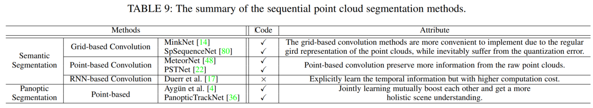

# Paper Notes on Sequential Point Clouds
[Arxiv2022](https://arxiv.org/abs/2204.09337)  , Haiyan Wang, Sequential Point Clouds: A Survey. 

Statistics: :fire: code is available & stars >= 100 &emsp;|&emsp; :star: citation >= 50

- - -

## Common Deep Network Architectures

### Conv-based
* **4D MinkNet [14]**  4D SpatioTemporal ConvNets: Minkowski Convolutional Neural Networks. [[CVPR 2019](https://openaccess.thecvf.com/content_CVPR_2019/papers/Choy_4D_Spatio-Temporal_ConvNets_Minkowski_Convolutional_Neural_Networks_CVPR_2019_paper.pdf)] [[page](https://nvidia.github.io/MinkowskiEngine/overview.html)] [cite 587] :star:

* **PSTNet [22]** PSTNet: Point spatio-temporal convolution on point cloud sequences. [[ICLR 2021](https://arxiv.org/pdf/2205.13713)] [cite 25]

### Point-based
* **MeteorNet [48]** MeteorNet: Deep learning on dynamic 3D point cloud sequences. [[ICCV 2019](https://openaccess.thecvf.com/content_ICCV_2019/papers/Liu_MeteorNet_Deep_Learning_on_Dynamic_3D_Point_Cloud_Sequences_ICCV_2019_paper.pdf)] [cite 102] :star:

### RNN-based
* **PointRNN [21]** PointRNN: Point recurrent neural network for moving point cloud processing. [[arxiv 2019](https://arxiv.org/pdf/1910.08287)] [cite 40]

Discussion

- For detection & segmentation tasks which require a better semantic understanding will be benefited more from feature learning of ConvNet.
- Those long-range sequence tasks such as action recognition or object tracking are more appropriate with RNN.

- - -

## Datasets

Commonly used SPL datasets

- - -

## Scene Flow Estimation

 First introduce the supervised methods, then the unsupervised ones. 

### Voxel-based Methods

* VoxelNet [128] [] [cite ]
* PointPillars [44] [] [cite ]
* **PointFlowNet [5]** [] [cite ]
* **Scalable Scene Flow [41]** [] [cite ]
* **VoxFlowNet [63]** [] [cite ]
* **PV-RAFT [100]** [] [cite ]

### Direct Point-based Methods

* **FlowNet3D [47, pioneer work]** [] [cite ]
* **FlowNet3D++ [98]** [] [cite ]
* **Dense RGBD Scene Flow [79, seg]** [] [cite ]
* **Festa [94]** [] [cite ]

### Lattice-based methods

* Bilateral Conv layers (BCL) [39] [] [cite ]
* **HPLFlowNet [30]** [] [cite ]

### Unsupervised Methods

* **PointPWC-Net [111]** [] [cite ]
* **Just Go with the Flow [60]** [] [cite ]

### Self-Add
- **Kinet** No Pain, Big Gain: Classify Dynamic Point Cloud Sequences with Static Models by Fitting Feature-level Space-time Surfaces. [[CVPR 2022](https://openaccess.thecvf.com/content/CVPR2022/papers/Zhong_No_Pain_Big_Gain_Classify_Dynamic_Point_Cloud_Sequences_With_CVPR_2022_paper.pdf)] [cite 1]

    To capture 3D motions without explicitly tracking correspondences, we propose a kinematicsinspired neural network (Kinet) by generalizing the kinematic concept of ST-surfaces to the feature space. By
    unrolling the normal solver of ST-surfaces in the feature space, Kinet implicitly encodes feature-level dynamics and gains advantages from the use of mature backbones for static point cloud processing. 

Discussion

- Overall, the point-based and the lattice-based methods outperform the voxel-based methods by a large margin.
- Almost all types of methods demonstrate a well generalization
ability from the synthetic domain (eg.FlyingThings3D) to the real world domain (eg.KITTI ).
- The unsupervised methods still achieve comparable performance even without any supervision. The unsupervised
methods become a more and more popular research trend for
the community.

- - -

## Point Cloud Detection

 summary of multi-frame object detection methods 

 quantitative detection results 

### Conv-based

+ **FaF [51]** 4D detection, tracking, motion forecasting, voxel+2Dconv, early+late fusion

+ SSD [117]  FaF follows the detection pipeline of SSD
+ **Second [115]** sparse conv on voxel

+ **IntentNet [11]** detection+intent prediction, BEV format

+ **What you see [32]** 2.5D data (RGBD or range image), built upon PointPillar, early+late fusion

### Graph-based

+ **Yin et al. [119]** AST-GRU, PMPNet

### RNN-based

+ **Huange et al. [35]** the first one that modeled temporal relations
among SPL with an RNN-based (LSTM) schema

+ **YOLO4D [18]**

+ **McCrae et al. [53]** PointPillar as baseline

### Offboard Detection

+ **Qi et al. [65, MVF++]**
followed the similar method of [32] which aggregated
temporal information by transforming other point cloud frames to
the current one to get rid of ego-motion and encoded time offsets
as an additional feature.

+ MVF [127]

 Discussion 
 

- By using SPL data and
devising spatio-temporal feature extracting techniques to
conduct object detection, those false bounding box results
are largely suppressed to ensure temporal consistency and
thus improve overall detection accuracy of the multi-frame methods.
- The RNN-based networks exploit more on temporal relations
among long-range time series, while high-level semantic
understanding tasks like detection prefer temporal consistency
in both spatial and temporal domains. 
- Almost all of the multi-frame detection methods are restricted
to less than 10 frames. Thus long-range SPL object detection
still remains as a challenging problem.

- - -

## Point Cloud Tracking

 Summary of the Multiple Object Tracking methods 

 Quantitative 3D MOT Results on KITTI 

### 3D-based Methods

+ **AB3DMOT [103]** as a compact baseline: pre-trained 3D object detector + 3D Kalman Filter with constant velocity model + Hungarian algorithm

+ **Chiu et al. [13]** 3D Kalman Filter with a constant linear and angular velocity model. Mahalanobis distance for data association process and co-variance matrices for the state prediction process.

+ **PointTrackNet [95]** conduct object detection for two continuous point cloud frames, refined by an association model.

+ **P2B [69]** with a point-wise schema, no Kalman filter, end-to-end network, treated the tracking task as the detection task inspired by VoteNet; better than [27].

+ Leveraging shape completion [27]

+ **Giancola et al. [27]** proposed the first 4D MOT
Siamese network structure

+ **FaF [51]** as mentioned before: 4D detection, tracking, motion forecasting, voxel+2Dconv, early+late fusion. solved the tracking problem in an associative manner.

### Joint 2D and 3D based methods
In addition to SPL input, they involved another
modality RGB image to the network as well.

+ **DSM [23]** predicted object proposals using a Detection Network from the input point cloud and RGB sequence. After formulating discrete trajectories, a liner optimization process was utilized to generate final tracking results.

+ **GNN3DMOT [106]** Unlike [103] extracting object features independently to perform the Hungarian data association, GNN3DMOT offered a multi-modality feature extractor; firstly introduced a graph-based pipeline. 

+ **ComplexerYOLO [82]** generated semantic segmentation maps from input images, further back-projected to 3D space to obtain class-aware point clouds; predicted 3D bbox from the voxelized semantic point cloud.

+ mmMOT [122] Robust multi-modality multi-object tracking

 Discussion 

- joint 2D&3D-based methods are more frequently used by the recent research community with a relatively higher performance, which shows
the superiority of more modalities.
- Most high-performance methods still require an additional 2D
input to ensure tracking accuracy. This is a limitation with
extra data. In the real self-driving scenario, usually, it costs
much more to process multi-modalities at the same time.
- For almost all of 3D MOT methods, tracking performance is
based on detection performance. Only PointTrackNet [95] and
P2B [69] belong to a full end-to-end pipeline breaking the
limit of the off-shell detector. However, their performance is
not satisfied which leaves a potential improvement for future
research on this track.

- - -

## Point Cloud Segmentation

 summary of SPL segmentation methods 

 quantitative seg results on SemanticKITTI 

 quantitative seg results on Synthia4D 

 quantitative PanoSeg results on SemanticKITTI 

### 4D Semantic Segmentation

（simple gathering中介绍的应该都是单帧方案，比如经典的pointnet）
#### Simple Gathering - Projection based

- The input point clouds are primarily projected to the BEV (Bird’s Eye View) or the spherical space and then 2D segmentation pipelines can be easily applied to 2D projected data.
- Zhang et al. [121] and PolarNet [123] followed the BEV
(Bird’s Eye View) projection track.
- Studies [59], [107], [108], [114] followed the spherical projection track which treated the range image as the input. 

#### Simple Gathering - Conv based

- Some studies [34], [50], [54], [72], [89] transferred point cloud to voxel representation and adopted 3D conv.
- Papers [76], [84] splatted point cloud into the permutohedral lattice space to perform sparse conv.
- Octnet [73], PointConv [110], KPConv [90]

#### Simple Gathering - Point based
-  Inspired by PointNet and PointNet++, a tremendous of point-based methods such as [19], [33], [40], [124], [126] have been investigated to estimate semantic scene labels for point clouds.
- Some other methods such as [12], [92], [116], [125] introduced the attention mechanism.

#### Temporal Convolution - Grid based

- **4D MinkNet [14]** the first method that applied the deep conv net on
high dimensional data such as SPL. 

- **SpSequenceNet [80]** To better fuse global and local features：Cross-frame
Global Attention (CGA) and cross-frame local interpolation (CLI); followed the U-net design in paper SSCN [29] 

#### Temporal Convolution - Point based

- **MeteorNet [48]** MeteorNet built MeteorNet-Seg to conduct point-wise
semantic label prediction; using a similar structure as PointNet++; MeteorNet-Seg harnessed the Meteor-ind module and the early-fusion strategy.

- **PSTNet [22]** PST (transposed) conv; PSTNet was more compact yet effective while 4D MinkNet [14] required a relatively large computation cost.

#### Temporal Convolution - RNN based

- **Duerr et al. [17]** projected each point cloud frame to the image plane
dubbed as range image; the semantic feature would be perpetually reused, not just once in SpSequenceNet [80]; two recurrent strategies for feature fusion: Residual Net + Residual Net.

### 4D Panoptic Segmentation

- Panoptic segmentation is a merged joint segmentation task including semantic segmentation and instance segmentation, which was
first introduced in [43] in the image space and further extended
from image to video by [42].

- **Aygun et al. [4]** firstly proposed a 4D Panoptic Segmentation pipeline;  infer semantic classes for each point along with identifying the instance
ID;  One major contribution: devising a new point-centric evaluation method LSTQ (LiDAR Segmentation and Tracking Quality).

- **PanopticTrackNet [36]** blended panoptic segmentation and multi-object
tracking tasks; multi-head end-to-end network;  continuous RGB frames or point
clouds as input.

 Discussion 

- Additional temporal data improves the overall segmentation
accuracy by a large margin compared to static point cloud
methods.
- From Table 11, point-based convolution outperforms gridbased convolution in terms of both efficacy and efficiency.
- Overall segmentation performance is still limited on moving object classes which shows the large impact of motion information.
-  The panoptic segmentation methods significantly outperform
other basic segmentation methods by exploring a holistic
semantic scene understanding. The increase of scan numbers
brings consistent performance gain.

- - -

## Point Cloud Forecasting

 Summary of sequential pcd forecasting methods 

 Quantitative motion forecasting Results on NuScenes 

 Quantitative motion forecasting Results on ATG4D 

### Point Cloud Motion Forecasting

#### Bird’s Eye View (BEV) Representation
The below methods are all developed following the object detection-tracking-forecasting schema.

- **FaF [51]** was also the first one proposing a holistic network that jointly conducted object detection, tracking and motion forecasting from SPL input. 

- **IntentNet [11]** extended FaF [51] by predicting the intent, defined as the combination of the target behavior (e.g. moving directions) and motion trajectory. Besides SPL input, took an extra rasterized map as network’s input; these signals ( roads, traffic lights, traffic signs, etc.) provided a strong motion prior and contributed a lot to the intent prediction.

- **NMP [120]** further extended IntentNet [11] to integrate motion
planning into the end-to-end motion forecasting system.  Instead
of just predicting the moving angle as IntentNet [11], the purpose
of motion planning was to generate one optimistic trajectory with
minimum cost. multimodality models were trained together in an end-to-end manner.

- **Spagnn [10]** was also developed based on IntentNet [11] by adding the interaction model at the end for motion predictions; graph-based conv; 

#### Occupancy grid map (OGM) Representation
one major problem of the occupancy grid representation is hard to find the temporal correspondence between cells. It also excludes object class information. 
- **Schreiber et al. [78]** converted point cloud frames to a sequence of
dynamic OGM and input them to a ConvLSTM; added skip connections to the RNN.

- **MotionNet [109]** combined BEV and occupancy map representations and devised a novel representation named BEV map; exploited a novel spatio-temporal pyramid network named STPN to extract hierarchical features; light block spatio-temporal convolution (STC).

#### Range View Representation
The range map comes from spherical projection of point clouds.

- **LaserFlow [57]** the multi-sweep fusion architecture was
proposed to solve the coordinate system dis-alignment problem; transformer sub-network ; uncertainty curriculum learning.

### Sequential Point cloud Forecasting
The SPF (Sequential Pointcloud Forecasting) task is defined to predict future M point cloud frames given previous N frames. Instead of forecasting future point cloud information on the object level, SPF predicts the whole scene point clouds including foreground objects and background static scene. 

#### Single Frame Prediction

- **Sun et al. [87]** devised a ConvLSTM structure to predict future point cloud frames instead of using the 1D LSTM in [104]. 

- **Deng et al. [15]** adopted the scene flow embedding [47] to model the temporal relation among four input point cloud frames. PointNet++ [68] and Edge Conv [97] were introduced to extract 3D spatial features

#### Multi Frame Prediction

- **Weng et al. [104]** firstly investigated the SPF task and proposed SPFNet;  uses forecast-then-detect schema to replace the conventional detect-then-forecast idea;  exploited a new evaluation protocol. 

- **Mersch et al. [56]** proposed to utilize the 3D conv; Skip Connections
and Horizontal Circular Padding was introduced to capture detailed spatial-temporal information;

- S2net [102]

 Discussion 

- Though BEV representation is more frequently used, the methods adopting range view representation achieve better performance due to more complete information embedded.
- The errors sharply increase when the time range is extended. This shows the
limitation for handling longer-range SPL data.

## Future Directions

- **Unsupervised learning** Though there are a few unsupervised
methods for the scene flow estimation, most existing research
of sequential point clouds still rely on groundtruth labels as
the supervision signal.

- **Longer-range temporal dependency** One possible solution is to exploit point cloud compression techniques such as utilizing flow information to fill the temporal gaps. Meanwhile, transformers have been approved to be quite good at modeling temporal attention and capturing long-range dependencies.

- **Multitask Learning** one possible solution is to jointly learn those essential features (e.g. semantic flow) across multitasks.