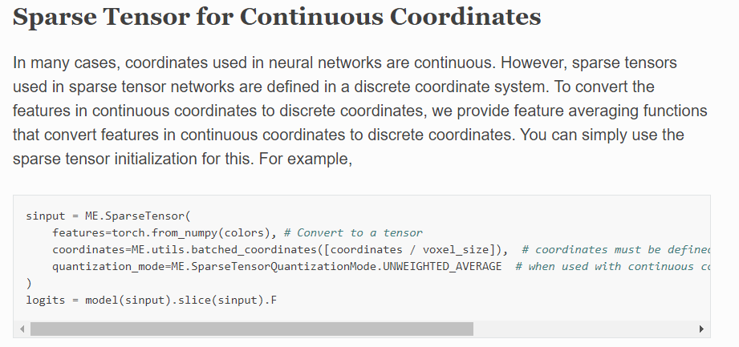

# Common Deep Network Architectures

## Conv-based
- **4D MinkNet** Christopher Choy (stanford), 4D SpatioTemporal ConvNets: Minkowski Convolutional Neural Networks. [[CVPR 2019](https://openaccess.thecvf.com/content_CVPR_2019/papers/Choy_4D_Spatio-Temporal_ConvNets_Minkowski_Convolutional_Neural_Networks_CVPR_2019_paper.pdf)] [[page](https://nvidia.github.io/MinkowskiEngine/overview.html)] [cite 587] :star:
- **PSTNet** `Hehe Fan` (NUS新加坡国立), ..., Yi Yang (UTS悉尼科技), PSTNet: Point spatio-temporal convolution on point cloud sequences. [[ICLR 2021](https://arxiv.org/pdf/2205.13713)] [[github](https://github.com/hehefan/Point-Spatio-Temporal-Convolution)] [cite 25]

## Point-based
- **MeteorNet** Xingyu Liu (Stanford), MeteorNet: Deep learning on dynamic 3D point cloud sequences. [[ICCV 2019](https://openaccess.thecvf.com/content_ICCV_2019/papers/Liu_MeteorNet_Deep_Learning_on_Dynamic_3D_Point_Cloud_Sequences_ICCV_2019_paper.pdf)] [[github](https://github.com/xingyul/meteornet)] [cite 102] :star:

## RNN-based

- **PointRNN** `Hehe Fan`, Yi Yang (UTS悉尼科技), PointRNN: Point recurrent neural network for moving point cloud processing. [[arxiv 2019](https://arxiv.org/pdf/1910.08287)] [[github](https://github.com/hehefan/PointRNN)] [cite 40]

## 自补
- **PSTNet2** `Hehe Fan`(UTS悉尼科技), Deep Hierarchical Representation of Point Cloud Videos via Spatio-Temporal Decomposition. [[TPAMI 2021](https://ieeexplore.ieee.org/abstract/document/9650574/)] [[github](https://github.com/hehefan/PSTNet2)] [cite 5]

- **P4Transformer** `Hehe Fan`, Yi Yang (UTS悉尼科技), Point 4d transformer networks for spatio-temporal modeling in point cloud videos. [[CVPR 2021](http://openaccess.thecvf.com/content/CVPR2021/papers/Fan_Point_4D_Transformer_Networks_for_Spatio-Temporal_Modeling_in_Point_Cloud_CVPR_2021_paper.pdf)] [cite 28]

- **PST-Transformer** `Hehe Fan` (NUS新加坡国立), (P4Transformer的扩展), Point spatio-temporal transformer networks for point cloud video modeling. [[TPAMI 2022](https://ieeexplore.ieee.org/abstract/document/9740525)] [cite 6]

- **3DV** Yancheng Wang (华科 & 旷视), 3DV: 3D Dynamic Voxel for Action Recognition in Depth Video. [[CVPR 2020](http://openaccess.thecvf.com/content_CVPR_2020/papers/Wang_3DV_3D_Dynamic_Voxel_for_Action_Recognition_in_Depth_Video_CVPR_2020_paper.pdf)] [[github](https://github.com/3huo/3DV-Action)] [cite 25]

- **CaSPR** Davis Rempe (Stanford), CaSPR: Learning canonical spatiotemporal point cloud representations. [[NIPS 2020](https://proceedings.neurips.cc/paper/2020/file/9de6d14fff9806d4bcd1ef555be766cd-Paper.pdf)] [[page](https://geometry.stanford.edu/projects/caspr/)] [cite 30]

- **PST^2** Yimin Wei (中山大学), Spatial-temporal transformer for 3d point cloud sequences. [[WACV 2022](https://openaccess.thecvf.com/content/WACV2022/papers/Wei_Spatial-Temporal_Transformer_for_3D_Point_Cloud_Sequences_WACV_2022_paper.pdf)] [cite 4]

- **SelfSupOrderPred** Haiyan Wang (纽约城市学院), Self-supervised 4d spatio-temporal feature learning via order prediction of sequential point cloud clips [[WACV 2021](https://openaccess.thecvf.com/content/WACV2021/papers/Wang_Self-Supervised_4D_Spatio-Temporal_Feature_Learning_via_Order_Prediction_of_Sequential_WACV_2021_paper.pdf)] [cite 7]

- **TPU-GAN** Zijie Li (CMU), TPU-GAN: Learning temporal coherence from dynamic point cloud sequences. [[openreview 2021](https://openreview.net/pdf?id=FEBFJ98FKx)] [cite 0]

- **ASTA3DConv** Guangming Wang (上交), Anchor-Based Spatio-Temporal Attention 3D convolutional networks for dynamic 3D point cloud sequences. [[TIM 2021](https://arxiv.org/pdf/2012.10860)] [[github](https://github.com/IRMVLab/ASTA3DConv)] [cite 12]

- **PointLSTM** Yuecong Min (中科院), An efficient pointlstm for point clouds based gesture recognition. [[CVPR 2020](http://openaccess.thecvf.com/content_CVPR_2020/papers/Min_An_Efficient_PointLSTM_for_Point_Clouds_Based_Gesture_Recognition_CVPR_2020_paper.pdf)] [cite 42]

- **ASAP-Net** Hanwen Cao, ..., Cewu Lu, ... (上交) ASAP-Net: Attention and structure aware point cloud sequence segmentation. [[BMVC 2020](https://arxiv.org/pdf/2008.05149.pdf)] [[github](https://github.com/intrepidChw/ASAP-Net)] [cite 9]

- CloudLSTM: A recurrent neural model for spatiotemporal point-cloud stream forecasting. [AAAI 2021] [cite 15]

- A closer look at spatiotemporal convolutions for action recognition. [CVPR 2018] [cite 1778]

- Tranquil clouds: Neural networks for learning temporally coherent features in point clouds. [arxiv 2019] [cite 11]

- - -

## Paper notes

<b> 4D MinkNet (CVPR 2019) </b>

- 关于sparse tensor，定义为坐标矩阵C，和特征矩阵F，参论文Sec.3.1；关于spare conv，参论文Sec.3.2，
- 注意MinkNet的输入其实是voxel，关于数据预处理：先要量化并生成sparse tensor；
    
    
- 以上可结合page链接中的package文档理解；
- 关于模型，给了MinkowskiNet18和MinkowskiUNet32，分别仿照ResNet18和UNet；
- 为了促进时序一致性，引入Trilateral Stationary-CRF，这里“三边”包括：3D space, 1D time, 3D chromatic space; 
- 关于CRF，暂不深究，后续用到的话，参考网络博客（deeplabv1-v2中有用到），以及代码实现去理解；

<b> PSTNet (ICLR 2021) </b>

- 应用：3D行为识别，4D语义分割；
- 在建模点云序列上，号称PST conv是第一个解耦空间和时间，以此建立的PSTNet号称是这方面的第一个DNN；
- 论文Sec.3.2.1中，介绍了将卷积核W分解为空间卷积核S，以及时间卷积核T；考虑到平移的连续性，进一步将空间卷积核S，替换为关于平移量的函数f，通常f可以被MLP实现，但作者选用了更轻量化的方式，仅用2个矩阵表示；
- PST conv图示：注意图中的subsampling rate是空间上的降采样率，temporal stride是时间上的步长。
    
- PST transposed conv图示：([P1;F1],...,[P5;F5])经过卷积后，得到序列([P1';F1'],...[P3';F3'])，现在要生成P1~P5的新特征F"；分为三步:(a)基于F'进行时序上的转置卷积得到M'，主观上是把1帧特征变成了3帧的特征；(b)时序上插值：对于第1/3/5帧，直接用M1'/M2'/M3'即可，对应图中只有2个点，对于第2/4帧，主观上是在插值，所以要分别结合M1'和M2'，以及M2'和M3'的结果，对应图中有4个点；(c)空间上的插值：这个沿用pointnet++中的方式，基于距离的逆进行加权。
    
- 文中称，由于点云的不规则和无序性，感受野不能靠空间降采样率来增大，所以需要逐步增大point tube中的空间搜索半径r；
- PSTNet for 3D action recognition：6 PSTconv + 1 FC_layer；test on dataset `MSR-Action3D` (Li et al., 2010), `NTU RGBD 60/120` (Shahroudy et al., 2016)
- PSTNet for 4D semantic segmentation：4 PSTconv + 4 PST_transp_conv; test on dataset `Synthia 4D` (Choy et al., 2019)
- PST conv的输出可视化：对运动区域有较高的激活
    

<b> MeteorNet (ICCV 2019) </b>

- 应用：分类、分割、场景流估计
- 点云序列的3个性质：1. 帧内无序，这个自然，点云中点的顺序不能影响模型输出；2. 帧间有序，改变一个点的时间戳，意味着把该点移到了另一帧，此时应该改变特征向量；3.时空度量，认为在空间和时间上都靠近的才是近邻。
- Meteor Module：inspired by PointNet. 给了两种更新特征向量的方式：1.Meteor-rel关注帧间对应关系，因此将每个point pair的2个特征fi,fj都concat起来，在场景流估计任务中用到该模块；2.Meteor-ind认为对于分类/分割这种任务，帧间对应关系不重要，所以只concat了fj的特征。
    
- 上述Meteor module中的近邻，是时间和空间层面上的，可以通过2种方式得到：1. direct grouping，一个物体能移动的最大距离，随着时间的增加而增加，故直接分组，就是随着|t-t'|的增大，增大分组半径；2.chained-flow grouping，利用已有的场景流估计方法比如FlowNet3D，估计t和t-1相邻两帧的point motion，可以得到t帧中的pi在t-1帧中的对应点（虚拟点），为了找到pi在t-2帧中的对应点，先要根据t-1帧中的点的flow，插值出t-1帧中虚拟点的flow，然后就能得到pi到t-2帧的flow，迭代进行，就能得到pi到每一帧的对应点；这种方式侧重跟踪每个点的运动规矩，可以使分组半径更小，提高计算效率。
    
- Early/Late Fusion: Early模式先使用Meteor模块，使得不同帧的点从一开始就混合在一起；Late模式先分别处理每帧点云，再通过Meteor模块；MeteorNet-cls和MeteorNet-seg使用了Early fusion；MeteorNet-flow采用了Late fusion；
    
- 下面展示MeteorNet-seg和MeteorNet-flow的网络结构；看起来是UNet样式；
    
- 文中还给了一个toy实验：在一个cube中放一个点，它能处于静态，或者低/中/高速运动共4种状态，要求网络对其分类。对比了基于grid occupancy输入的FaF和MinkNet和基于point的MeteorNet。该实验是用来证明，在grid上堆叠卷积来提升表达能力，是不充分不高效的。

- 来自ASTA3DConv的评价：MeteorNet only use max pooling for the
feature aggregation after grouping, which losses information

<b> PointRNN (arxiv 2019) </b>

- **应用**：预测3D场景流（scene flow）
- **概览**：首先，宏观比较RNN和PointRNN，前者处理向量，后者将其扩展到矩阵，此外由于点云的无序性，PointRNN要给输入、输出和状态，都添加点云坐标（因为每一个RNN的步骤，都需要基于坐标确定时空层面的近邻）
    
- **具体操作**：图(a)中是RNN的操作，将输入$x_t$和状态$s_{t-1}$两者concat，然后再变回$d'$维，作为新的状态$s_t$；图(b)是PointRNN的操作，核心是公式2，给当前帧$P_t$中的每个点（作为查询点），查训它在上一帧$P_{t-1}$中的近邻（即时空层面的近邻，用KNN或ball-query），然后将查询点的特征，近邻的状态，近邻到查训点的坐标偏移这三者concat，送入共享的FC层进行维度变换，池化后得到新的状态，这个状态融合了点云序列过去的特征和当前的特征！
    
- **整体结构**（seq2seq framework）：一个PointRNN充当encoder，一个PointRNN做predictor；encoder逐帧处理点云序列，等处理完最后一帧$P_t$后，用encoder的状态初始化predictor，然后predictor把$P_t$作为输入，开始预测$\Delta{P_t}$，即scene flow。可以堆叠多个PointRNN构建分层预测结构，但是由于所有点都在每一层中进行处理，此结构的主要问题是计算量大，为此，提出一个高级模型如图(b)，该模型借鉴了PointNet++的两个组件，即sampling&grouping和feature propagation。
    
- **模型训练 & 损失函数**：(1) teacher-forcing training，这种是把gt作为predictor的输入；(2) free-running training，这种是网络自己的预测作为输入，对应上面Fig.3(a)。作者发现，若用第一种方式训练，模型会陷入bad local optima，此时对所有输入都有$\Delta{P_t}$接近0，这个想来也自然，对于采样频率高的两个相邻点云序列，运动本身就很小；于是作者采用了第二种方式训练。至于损失函数，用的是$P$和$P'$之间的chamfer distance loss和emd loss，论文没有解释，分析这里$P$应该是gt，$P'$是预测的点云位置。
- test on one synthetic moving MNIST point cloud dataset, and two large-scale real-world datasets, Argoverse and nuScenes. 

- **来自survey(CAC 2021)的评价**：However, PointRNN lacks the local spatial features in each fram.

<b> P4Transformer (CVPR 2021) </b>

- **应用**：3D动作识别，4D语义分割
- **摘要**：点云视频在空间维度上展现了不规则和无序性，在不同帧中，点的出现也无法保证一致性。点跟踪常用于捕获点云视频流中的动态信息，但是表示同一位置的点在不同帧中时有时无，使得计算精确的点轨迹非常困难，并且跟踪通常还依赖于点的颜色，因此在缺乏颜色信息的点云中容易失效。本文为了避免点跟踪，提出了Point 4D Transformer (P4Transformer) 以处理原始点云视频，本文是第一个将Transformer用于时空点云处理的工作。
- **idea示意图**：包括point 4D conv和transformer，分别用来学习时空层面的局部特征和全局特征。
    
- **网络结构**：这里point 4D conv跟作者自己的PSTNet中的操作基本一致，它把每个时空层面的local area映射为一个向量，然后，考虑到anchor点的位置也反映了局部区域之间的关系，因此将anchor坐标和局部特征一并送入transformer。
    
- **Datasets**: MSRAction3D, NTU RGBD 60/120, Synthia 4D

<b> PST-Transformer (TPAMI 2022) </b>

- 本文是作者的P4Transformer的期刊扩展版；
- 贴一个对比图，具体暂不深究；
    

<b> CaSPR (NIPS 2020) </b>

- **摘要**：本文学习以物体为中心的正规化空时点云表达（object-centric **Ca**nonical **S**patiotemporal
**P**oint Cloud **R**epresentations），它能聚合和编码物体形状在空时层面的变化（spatiotemporal changes）。对空时表达的要求：1. 要能在空时层面连续捕捉物体形状，并支持任意空时分辨率的形状生成；2. 要对不规则的采样模式鲁棒；3. 要能类内泛化到未见的实例，和未见的时序（temporal dynamics）。该问题分成2个子任务：1.扩展NOCS到时间层面，得到T-NOCS，先将输入点云序列标准化；2.再利用神经常微分方程（neural ordinary differential equations, 简写Neural ODEs）学习空时的隐层表达，利用连续的标准化流学习（continuous normalizing flows，简写CNFs）形状的生成模型。

- TPU-GAN中的评价：CaSPR focuses on objectcentric tasks and thus is not available for processing multi-object collections or scenes. 

- **网络结构**：涉及背景知识较多，暂不深究；
    

 <b> 3DV (CVPR 2020) </b> 

- **要点**：The main contributions of this paper include:
    - 3DV: a novel and compact 3D motion representative manner for 3D action characterization （3DV是动态体素的意思，可用作为3D action的表达）; 
    - PointNet++ is applied to 3DV for 3D action recognition in end-to-end learning way, from point set perspective; （3DV用3Dcnn处理更直接，但作者将3DV重新转换为点集，然后基于PointNet++处理）
    - A multi-stream deep learning model is proposed to learn 3D motion and appearance feature jointly.

- **补充关于Rank Pooling**： Basura Fernando (澳国立), Rank Pooling for Action Recognition. [[TPAMI 2016](https://arxiv.org/pdf/1512.01848)] [cite 301] —— 提出temporal rank pooling来表征视频；通过[blog](https://www.cnblogs.com/jie-dcai/p/5755650.html)简单了解；

- **3DV示例**：
    - (1) Fig.1中展示了握手的3DV，需要先将点云的序列转换为binary voxel set的序列，然后才能用temporal rank pooling，将voxel set序列整合为一个voxel set，即3DV；
    - (2) ranking parameter $w\in \mathbb{R}^d$ 反映了视频帧的排序关系，它是由RankSVM优化得到，一个基本假设是，同一类action视频，得到的$w$应该是接近的，于是$w$就能作为该action视频的表达！
    - (3)  Each 3DV voxel can be jointly encoded by the corresponding $w^*$ item as motion feature and its regular 3D position index $(x, y, z)$ as spatial feature. 这里没说清楚，估计是这个意思：有了优化后的$w^*$，可用给每一帧voxel set赋予一个ranking score，该值越大，表面该帧在时序上越靠后，ranking score即作为该帧的motion feature；对于位于$(x, y, z)$处的voxel，它可能出现在不同帧，于是将不同帧的ranking score求平均作为3DV中的motion feature取值，Fig.1中展示的应该就是该score的std。
    

- 其余内容：略

 <b> PST^2 (WACV 2022) </b> 

- **应用**：3D动作识别，4D语义分割
- **摘要**：We propose **Point Spatial-Temporal Transformer** (PST2) to learn spatial-temporal representations from dynamic 3D point cloud sequences. Our PST2 consists of two major modules: a Spatio-Temporal Self-Attention (STSA) module
and a Resolution Embedding (RE) module. Our STSA module is introduced to capture the spatial-temporal context information across adjacent frames, while the RE module is
proposed to aggregate features across neighbors to enhance
the resolution of feature maps. ... test on Synthia, SemanticKITTI and MSR-Action3D.

- **网络结构**：
    

- **子模块** 
    - Fig.2: The resolution block extracts the spatial context information from the input features, and treats these context information as an enhanced resolution to incorporate with the features produced by the feature block. This process aims at effectively extracting the spatial inter-neighborhood related information. 没太明白这些操作：分辨率block沿着空间维度divide，再沿着特征维度concat，就作为分辨率增强？！暂跳过...
    - Fig.3: Inspired by [7], we first divide spatial features $I_i^{(t)}$ into patches and then align these inter-frame spatial patches along the temporal domain based on the same seed points to form spatialtemporal patches. 暂跳过...
    

 <b> SelfSupOrderPred (WACV 2021) </b> 

- 应用：3D近邻检索；3D行为识别
- **摘要**：We propose a self-supervised schema to learn 4D spatio-temporal features by predicting the temporal order of sampled and shuffled point cloud clips. we introduce 4D convolution neural networks to predict the temporal order on a self-created large scale dataset, NTUPCLs, derived from the NTU-RGB+D dataset.

- **算法流程**
    - 若干连续的点云帧，构成一个clip，总共采样N个clip，任2个clip都没有重叠，并且总共有m帧间隔。
    - 特征学习网络，采用 4D MinkNet 和 MeteorNet 两种；
    - 把temporal order prediction当作多分类问题；比如总共有N个clip，则有N！种打乱方式，模型输出N！个概率，取对应概率最大的order作为预测；
    - The temporal order is predicted recurrently.
    

 <b> TPU-GAN (openreview 2021) </b> 

- 任务：用生成器进行点云上采样，在时序和空间上分别引入判别器进行对抗；
- 测试：流体动力系统中的粒子，和人体动作扫描数据；
- **摘要**：We propose a super-resolution GAN for dynamic point cloud sequences without requiring point correspondence annotation. Our model, **Temporal Point cloud Upsampling GAN** (TPU-GAN), can implicitly learn the underlying temporal coherence from point cloud sequence, which in turn guides the generator to produce temporally coherent output. 

- **网络结构**：
    

 <b> ASTA3DConv (TIM 2021) </b> 

- **应用**：3D动作识别，4D语义分割；
- **核心**
    - (1) 引入虚拟anchor构建规则的四面体结构，使ASTA3DConv能直接在原始点云序列上操作，而一般voxel-based方法要先将点云体素化；
    - (2) ASTA3DConv在给anchor聚合近邻信息时，采用了MLP+加权融合的方式，而一般point-based方法中用MLP+MaxPooling，缺乏结构化的描述能力，存在信息损失；
    - (3) ASTA3DConv对每个anchor考虑了跨帧的近邻，因此最后提取到的是"时空"近邻特征！

- **摘要**：ASTA3DConv is proposed in this paper to process dynamic
3D point cloud sequences. The proposed convolution operation
builds a regular receptive field around each point by setting
several virtual anchors around each point. The features of
neighborhood points are firstly aggregated to each anchor based
on the spatio-temporal attention mechanism. Then, anchor-based
3D convolution is adopted to aggregate these anchors’ features
to the core points... test on MSRAction3D and Synthia datasets.

- **anchor可视化**：红色点是核心点，从原始点云中FPS采样得到；浅绿和深绿点是不同帧的近邻；每个核心点都设置4个虚拟的黄色anchor点（anchor坐标可直接由公式算出），构成规则的四面体，于是可用1x4的3D卷积将anchor特征融合为核心点的特征！每个anchor会根据不同的半径，找跨帧的8个近邻点，并将它们的特征加权融合为自己的特征。
    

- **细节可视化**：结合论文描述，流程还是比较直接的，注意这里输入是点云序列，$(N,3+c+1)$中的1对应timestamps，输出$(N,C')$是所有N个点的特征，这时的特征已经是汇聚了时空局部信息的特征。
    

- **整体网络结构**：
    

 <b> ASAP-Net (BMVC 2020) </b> 

- **应用** 点云分割; test on Synthia and SemanticKITTI datasets.
- **摘要**： (1) We propose a flexible architecture called ASAP module which can be easily plugged into previous static point cloud pipeline and achieve improvement by a large margin. (2) We introduce a novel attentive temporal embedding layer to fuse the spatial local features across frames by automatically calculating attentions. (3) We present a spatio-temporal correlation strategy to exploit structural information, enforce temporal consistency and reduce computation.

- **ASAP模块结构**：(1) 输入当前帧点云$(n,3+c_1)$，及其FPS采样得到的m个center点；(2) LSA很简单，对每个center点，聚合指定半径范围内的近邻，基于MLP+MaxPooling将近邻特征传递给center得到$(m,c2)$；(3) 再将上一帧的center特征$(m,c2)$一并输入，经过图中的注意力加权和MLP，得到当前帧这m个center点的特征$(m,c_3)$；(4) 注意center特征是递归进行的，因此当前帧也能感知前序多帧的信息；
    

- **时空相关性**：很简单，仅在第一帧中FPS采样得到centers，然后后续帧继续沿用这些centers，本文认为虽然后续帧可能不存在这些中心点，但它们的近邻区域是存在的。**【评】这个操作构成了一个时空tube，PSTNet(ICLR 2021)中也用到了这个概念，不过没有引用该文**。
    

 <b> PointLSTM (CVPR 2020) </b> 

- 应用：3D手势识别；3D行为识别；test on NVGesture, SHREC’17 and MSR Action3D. 
- **摘要**：We formulate gesture recognition as an irregular sequence recognition problem and aim to capture long-term spatial correlations across point cloud sequences. The proposed PointLSTM **combines state information from neighboring points in the past with current features to update the current states** by a weight-shared LSTM layer. ref to Fig1(b) 
    

- **PointLSTM基本思想**：(1) Fig.2(a)更详细地展示了PointLSTM结构，基本对应了上图中的idea示意图及公式表述；(2) Fig.2(b)展示了变体模型PointLSTM-PSS的结构，考虑到给每个点都赋予单独的state，太耗时（应该也耗内存啊），所以PointLSTM-PSS设置一帧中的所有点都共享state，各帧的state，是由该帧包含的所有点的虚拟state（对应$(\tilde{h}, \tilde{c})_{n_t}^{(t-1)}$），执行平均池化而来，注意每帧点云包含任意点数，记为$n_t$；
    

- **Neighborhood Grouping**: 文中尝试了2种分组方式，Direct grouping直接在前序帧中，找当前帧中的点$p_{t,i}$的近邻；Aligned grouping，一般是先预测反向的场景流$\Delta x_i^{(t)}$，得到$p_{t,i}$在前序帧中的对应点位置，然后基于对应点找近邻，然而场景流预测本身就很困难，作者直接把$\Delta x_i^{(t)}$用点云帧的均值点的偏移来近似代替！

- **PointLSTM嵌入FlickerNet(BMVC 2019)**：
    

 <b> ... </b> 

- **摘要**：

- **网络结构**：
    

