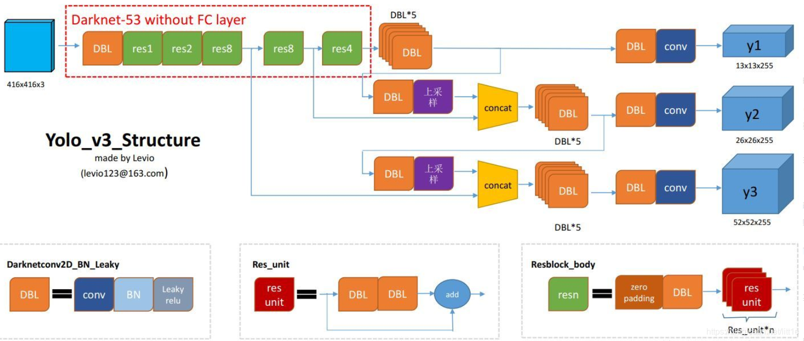
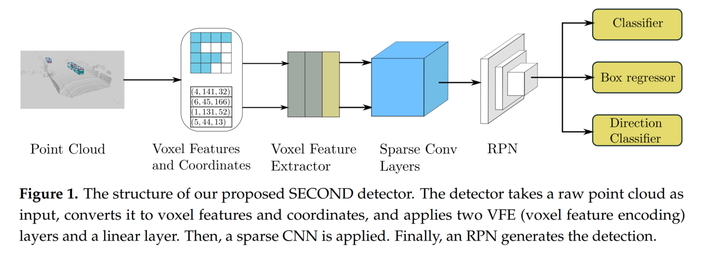

# Point Cloud Detection

## Conv-based

+ **FaF** Wenjie Luo (uber公司), Fast and furious: Real time end-to-end 3D detection, tracking and motion forecasting with a single convolutional net. [[CVPR 2018](https://openaccess.thecvf.com/content_cvpr_2018/papers/Luo_Fast_and_Furious_CVPR_2018_paper.pdf)] [cite 450] :star:

    4D detection, tracking, motion forecasting, voxel+2Dconv, early+late fusion； FaF follows the detection pipeline of SSD

+ **3DSSD** Zetong Yang (CUHK), 3dssd: Point-based 3d single stage object detector. [[CVPR 2020](http://openaccess.thecvf.com/content_CVPR_2020/papers/Yang_3DSSD_Point-Based_3D_Single_Stage_Object_Detector_CVPR_2020_paper.pdf)] [[github](https://github.com/dvlab-research/3DSSD)] [cite 262] :star:

+ **Second** Yan Yan (重庆大学), Second: Sparsely embedded
convolutional detection. [[Sensors 2018](https://www.mdpi.com/1424-8220/18/10/3337/htm)] [[github](https://github.com/traveller59/second.pytorch)] [cite 870] :star:

    sparse conv on voxel 

+ **IntentNet** Sergio Casas (多伦多大学), Intentnet: Learning to predict intention from raw sensor data. [[PMLR 2018](http://proceedings.mlr.press/v87/casas18a/casas18a.pdf)] [cite 245] :star:

    detection+intent prediction, BEV format

+ **What you see** Peiyun Hu (CMU), What you
see is what you get: Exploiting visibility for 3d object detection. [[CVPR 2020](https://openaccess.thecvf.com/content_CVPR_2020/papers/Hu_What_You_See_is_What_You_Get_Exploiting_Visibility_for_CVPR_2020_paper.pdf)] [cite 64] :star:

    2.5D data (RGBD or range image), built upon PointPillar, early+late fusion

## Graph-based

+ **3DVID** Junbo Yin (北理工 & 百度), ..., Ruigang
Yang (), Lidar-based online 3d video object detection with graphbased message passing and spatiotemporal transformer attention. [[CVPR 2020](http://openaccess.thecvf.com/content_CVPR_2020/papers/Yin_LiDAR-Based_Online_3D_Video_Object_Detection_With_Graph-Based_Message_Passing_CVPR_2020_paper.pdf)] [[github](https://github.com/yinjunbo/3DVID)] [cite 60] :star:

    AST-GRU, PMPNet

## RNN-based

+ **LSTM-Det** Rui Huang (Google), An lstm approach to temporal 3d object detection in lidar point clouds. [[ECCV 2020](https://arxiv.org/pdf/2007.12392)] [cite 41]

    the first one that modeled temporal relations
among SPL with an RNN-based (LSTM) schema

+ **YOLO4D** Ahmad El Sallab (valeo公司), Yolo4d: A spatio-temporal approach for realtime multi-object detection and classification from lidar point clouds. [[NIPSW 2018](https://openreview.net/pdf?id=B1xWZic29m)] [cite 19]

+ **Recurrent PointPillars** Scott McCrae (加州伯克利), 3D object detection for autonomous driving using temporal LiDAR data.  [[ICIP 2020]()] [cite 15]

## Offboard Detection

+ **Offboard 3D Auto Labeling** `CR.Qi` (Waymo公司), Offboard 3d object detection from point cloud sequences. [[CVPR 2021](https://openaccess.thecvf.com/content/CVPR2021/papers/Qi_Offboard_3D_Object_Detection_From_Point_Cloud_Sequences_CVPR_2021_paper.pdf)] [[supp](https://openaccess.thecvf.com/content/CVPR2021/supplemental/Qi_Offboard_3D_Object_CVPR_2021_supplemental.zip)] [cite 41]

    

## self-add

+ **MVF** `Yin Zhou` (Waymo), End-to-end multi-view fusion for 3d object detection in lidar point clouds. [[CoRL 2020](http://proceedings.mlr.press/v100/zhou20a/zhou20a.pdf)] [cite 160] :star:

- **PointPillars** Alex H. Lang (nuTonomy公司), PointPillars: Fast Encoders for Object Detection from Point Clouds. [[CVPR 2019](https://openaccess.thecvf.com/content_CVPR_2019/papers/Lang_PointPillars_Fast_Encoders_for_Object_Detection_From_Point_Clouds_CVPR_2019_paper.pdf)] [[github](https://github.com/SmallMunich/nutonomy_pointpillars)] [cite 1184] :star:

- **VoxelNet**  Yin Zhou (苹果公司), VoxelNet: End-to-End Learning for Point Cloud Based 3D Object Detection. [[CVPR 2018](http://openaccess.thecvf.com/content_cvpr_2018/papers/Zhou_VoxelNet_End-to-End_Learning_CVPR_2018_paper.pdf)] [[github-非官方](https://github.com/skyhehe123/VoxelNet-pytorch)] [cite 1965] :star:

- **PV-RCNN** `Shaoshuai Shi` (CUHK), PV-RCNN: Point-Voxel Feature Set Abstraction for 3D Object Detection. [[CVPR 2020]()] [cite 569] :star:

- **PointRCNN** `Shaoshuai Shi` (CUHK), PointRCNN: 3D Object Proposal Generation and Detection from Point Cloud. [[CVPR 2019](http://openaccess.thecvf.com/content_CVPR_2019/papers/Shi_PointRCNN_3D_Object_Proposal_Generation_and_Detection_From_Point_Cloud_CVPR_2019_paper.pdf)] [[github](https://github.com/sshaoshuai/PointRCNN)] [cite 1081] :star:
 

- **3D-MAN** Zetong Yang(Waymo公司), 3D-MAN: 3D Multi-frame Attention Network for Object Detection. [[CVPR 2021](https://openaccess.thecvf.com/content/CVPR2021/papers/Yang_3D-MAN_3D_Multi-Frame_Attention_Network_for_Object_Detection_CVPR_2021_paper.pdf)] [cite 17]
    
    基于注意力机制融合多帧信息

- **RSN** Pei Sun (Waymo公司), RSN: Range Sparse Net for Efficient, Accurate LiDAR 3D Object Detection. [[CVPR 2021](https://openaccess.thecvf.com/content/CVPR2021/papers/Sun_RSN_Range_Sparse_Net_for_Efficient_Accurate_LiDAR_3D_Object_CVPR_2021_paper.pdf)] [cite 31]
    
    专注高效性，引入语义稀疏（range image: 把点云转为图片格式，三通道：range, intensity, elongation）

- **SPG** Qiangeng Xu (南加州大学 & Waymo公司), SPG: Unsupervised Domain Adaptation for 3D Object Detection via Semantic Point Generation. [[ICCV 2021](https://openaccess.thecvf.com/content/ICCV2021/papers/Xu_SPG_Unsupervised_Domain_Adaptation_for_3D_Object_Detection_via_Semantic_ICCV_2021_paper.pdf)] [cite 22]
    
    3D语义分割 + 前景形状恢复

- **SCS** Mao Ye (UTA & Waymo公司), Multi-Class 3D Object Detection with Single-Class Supervision. [[arxiv 2022](https://arxiv.org/pdf/2205.05703)]
    
    定义了SCS单类监督的setting，比如一个数据集标注了车，另一个数据集标注了人，希望利用二者训练一个检测车和人的detector。

- **Voxel-FPN** Voxel-FPN: Multi-Scale Voxel Feature Aggregation for 3D Object Detection from LIDAR Point Clouds. [[Sensors 2020](https://www.mdpi.com/1424-8220/20/3/704/pdf)] [cite 99]

- **PIXOR** Bin Yang (uber公司) , Pixor: Real-time 3d object detection from point clouds. [[CVPR 2018](https://openaccess.thecvf.com/content_cvpr_2018/papers/Yang_PIXOR_Real-Time_3D_CVPR_2018_paper.pdf)] [cite 749] :star:

- **YOLO3D**  Waleed Ali (Valeo公司), YOLO3D: End-to-end real-time 3d oriented object bounding box detection from lidar point cloud. [[ECCVW 2018](https://openaccess.thecvf.com/content_ECCVW_2018/papers/11131/Ali_YOLO3D_End-to-end_real-time_3D_Oriented_Object_Bounding_Box_Detection_from_ECCVW_2018_paper.pdf)] [cite 95]

- **MV3D** Xiaozhi Chen (清华&百度), Multi-View 3D Object Detection Network for Autonomous Driving. [[CVPR 2017](https://arxiv.org/abs/1611.07759)] [[github](https://github.com/bostondiditeam/MV3D)] [cite 1945] :star:

- **AVOD** Jason Ku (滑铁卢大学), Joint 3D Proposal Generation and Object Detection from View Aggregation. [[IROS 2018](https://arxiv.org/pdf/1712.02294.pdf)] [[github](https://github.com/kujason/avod)] [cite 981] :star: 

- **Sensor Fusion** Gregory P. Meyer (Uber公司), Sensor Fusion for Joint 3D Object Detection and Semantic Segmentation. [[CVPRW 2019](https://openaccess.thecvf.com/content_CVPRW_2019/papers/WAD/Meyer_Sensor_Fusion_for_Joint_3D_Object_Detection_and_Semantic_Segmentation_CVPRW_2019_paper.pdf)] [cite 82]

- **Frustum convnet** Zhixin Wang and Kui Jia (华南理工), Frustum convnet: Sliding frustums to aggregate local point-wise features
for amodal 3d object detection. [[IROS 2019](https://arxiv.org/pdf/1903.01864.pdf)] [[github](https://github.com/zhixinwang/frustum-convnet)] [cite 270] :star: 

- **Frustum PointNets** Charles R. Qi (Stanford), Frustum PointNets for 3D Object Detection from RGB-D Data. [[CVPR 2018](https://openaccess.thecvf.com/content_cvpr_2018/papers/Qi_Frustum_PointNets_for_CVPR_2018_paper.pdf)] [[github](https://github.com/charlesq34/frustum-pointnets)] [cite 1639] :star:

- **MPPNet** Xuesong Chen (MMLab, CUHK), MPPNet: Multi-Frame Feature Intertwining with Proxy Points for 3D Temporal Object Detection. [[ECCV 2022](https://arxiv.org/pdf/2205.05979)]

- 关于VoteNet及其扩展版ImVoteNet，暂不记录于此，可参知乎讲解：[VoteNet](https://zhuanlan.zhihu.com/p/94355668)，[ImVoteNet](https://zhuanlan.zhihu.com/p/125754197)。

- - -

## Paper notes

 <b> VoxelNet (CVPR 2018) </b> 

- 摘要：VoxelNet是一个通用的3D检测网络，它统一了特征提取和bbox预测到一个单阶段、端到端的深度网络中。

- 流程概述：将三维点云体素化，经过点的随机采样以及归一化后（随机采样：将点云数量超过T的voxel中的点数降至T），对每一个非空Voxel使用若干个VFE(Voxel Feature Encoding)层进行局部特征提取，得到Voxel-wise Feature，然后经过3D Convolutional Middle Layers进一步抽象特征（增大感受野并学习几何空间表示），最后使用RPN对物体进行分类检测与位置回归。

- 整体网络结构
    

- 子网络结构：(1) VFE层沿用了PointNet的设计思路；(2) RPN网络以中间卷积层的输出特征图为输入，经过三次下采样（每次stride=2）获得三个不同维度的特征图，类似FPN缩放后拼接，最后，拼接特征被映射成两个输出特征图。
    

- 关于高效实现：
    + 初始化1个$K\times T\times 7$的张量结构，充当voxel input feature buffer，其中$K$是非空voxel的最大数目，$T$是每个voxel包含的最大点数，$7$是输入点云的特征维度（3维的xyz坐标 + 1维的反射率 + 3维的相对于局部中心的偏移）。
    + 所以下图中，一行对于一个voxel，然后每个voxel包含的点数可能不同，对应到绿色方块的数目也不同，该点云对应的非空voxel数目可能不到$K$，对应到图中最下面可能有"空"行。
    + 构建图中2个buffer的大概思路是，对于点云中的每个点，检查它所属的voxel是否存在，这一步是利用哈希表查训（voxel坐标是hash key），1) 如果存在，并且feature buffer中的对应行少于T个点，则将当前点加入，若已有T个点，则忽略，2) 如果不存在，则初始化一个新的voxel，并将该点加入。如Fig.5，有了voxel feature后，再根据voxel坐标，恢复出sparse 4D tensor。
    + 一个细节，对应下图代码截图中的mask部分：由于feature buffer中存在empty points（图中的白色块），比如对应的特征是0向量，在VFE中经过FC等操作后，这部分特征可能就变成非零的了，因此，在VFE中执行concat操作后，要把对应empty points的特征重新置为0，以免影响voxel feature。
    

 <b> PointPillars (CVPR 2019) </b> 

- copy博客：现有研究喜欢将不规则、稀疏的点云数据按照以下两种方式进行处理，然后引入RPN层进行3D Bbox Proposal，这两种方法为：将点云体素化，比如VoxelNet和SECOND；将点云转BEV格式，比如MV3D和AVOD。本文将Point转化成一个个Pillar（柱体），从而构成伪图片数据，作者采用SSD对伪图片数据提取BBox Proposal。由于使用了pillar的方式，一个$(x,y)$ location只有一个pillar, 而不是many voxels，元素便少了，自然速度就快了。

- 网络结构
    + 按照点云的X，Y轴（不考虑Z轴）将其划分为网格，落入到一个网格的点云数据，构成一个Pillar；每个点用一个$D=9$维的向量表示，$(x,y,z,r,x_c,y_c,z_c,x_p,y_p)$，分别是3维坐标，1维反射强度，3维pillar内的局部中心坐标，2维的点相对于局部中心的偏移；
    + 假设每个样本中有$P$个非空的pillars，每个pillar中有$N$个点云数据，那么这个样本就可以用一个$(D,P,N)$的张量表示。这里为了保证pillar中的点数为$N$，要么随机采样（原本点数超过$N$），要么补0（原本点数少于$N$）；
    + 实现张量化后，作者利用简化版本的PointNet对张量化的点云数据进行特征提取，得到$(C,P,N)$的张量；接着，沿着$N$所在维度进行Max Pooling，得到$(C,P)$维度的特征图；为了获得伪图片特征，作者将$P$转化为$(H,W)$，于是得到$(C,H,W)$的伪图片，至此Pillar Feature Net部分结束。
    + 接着，伪图片作为2D CNN的输入，用来进一步提取图片特征，最后接一个SSD检测头。
    

- 该模型最主要的特点是检测速度和精度的平衡。该模型的平均检测速度达到了62Hz，最快速度达到了105Hz，确实遥遥领先了其他的模型，这里引入CIA-SSD模型中的精度-速度图。
    

 <b> Offboard 3D Auto Labeling (CVPR 2021) </b> 

- copy博客：提出一个利用点云序列数据的离线3D物体检测管线，用作自动化3D标注工具。该方法主要运用coarse-to-fine的思想：第一阶段通过现有的检测、跟踪方法，生成粗标注；第二阶段通过汇总跟踪的点云和bbox，生成精细标注。本文证明了**利用时序信息的有效性**（甚至比相机数据的提升更大）。

- **时序利用**：有2种方式，一个是扩展单帧3D目标检测算法到多帧，已有一些工作（FaF, What you see, Huange et al.）展示了这样做的效果，但是很难扩展到利用更多帧，作者发现随着帧数增多，性能收益边际递减；此外，这些方法无法补偿物体运动，因为是对整个场景进行帧叠加。另外一种方式是扩展两阶段的目标检测器，相比于输入多帧整个场景，这类方法在第二阶段只处理多帧的proposal区域，然而，无法有效地确定到底用多少帧好，一个固定取值可能对一些物体好，但对另一些物体不适合。

- 相比于前述的frame-centric的方案，作者提出object-centric的思路，即先检测，再跟踪，然后就可以对每个物体，提取它出现的所有帧中的物体原始点云和bbox（对应构成了4D数据，包括3D空间和1D时间），这样相当于是自适应地用到不同长度的序列信息！

- 基于点云序列，可以利用不同视图获取更完整稠密的物体点云。
    

- 3D自动标注管线：3D检测器是MVF++，是作者对已有工作MVF的改进；tracker是基于AB3DMOT的变体，利用bbox做数据关联，用卡尔曼滤波做状态更新；在标注阶段，先分类物体的运动状态，然后对静态和动态物体分别处理。
    

- 对静态物体，模型输入合并的多帧点云数据（转换到世界坐标系），然后转到score最高的bbox对应的box坐标系，点云先经过语义分割得到前景点，再基于前景点提特征预测一个bbox（不是每帧都单独一个bbox，避免抖动）；根据传感器的pose，可以将bbox转换到各帧；参考Cascade-RCNN，采用了迭代式回归。

- 对动态物体，要给每一帧都预测一个bbox；自己的理解，图5中的输入仍然是世界坐标系下的点云/bbox，因为物体运动了，所以形成“轨迹”的样子。一种方案是将物体点云对齐到关键帧（比如当前帧），自己理解，这样就变成了静态时的输入，但作者称对齐这个任务，可比bbox回归要难，尤其是对于遮挡和远处的物体（只有少量点），以及对于行人这种deformabl object。因此，作者利用物体的点云序列和bbox序列，以一种滑窗的方式预测bbox。具体地，对于点云分支，输入sub-sequence（以第T帧为中心帧并前后扩r帧构成），先直接merge点云，然后转到中心帧的box坐标系，然后也是先进行语义分割得到前景点，再对前景点基于pointnet这类网络提特征（point embedding）；对于bbox分支，输入sub-sequence（以第T帧为中心帧并前后扩s帧构成；注意s可以大于r；box是7维几何+1维时序），先转到中心帧的box坐标系，再编码为轨迹嵌入（trajectory embedding）；最后，将点云和bbox的嵌入concat起来做bbox回归。
    
    

 <b> Voxel-FPN (Sensors 2020) </b> 

- 摘要：目前基于体素的3D目标检测多为从单一尺度的体素中提取体素特征信息，作者提出了Voxel-FPN，一种基于点云的one-stage 3D目标检测器。核心框架包括编码器网络、解码器和区域候选网络(RPN)。编码器以自底向上的方式提取多尺度体素信息，而解码器采用自顶向下的方式融合不同尺度的多特征映射。

- 网络结构
    

 <b> LSTM-Det (ECCV 2020) 关注 </b> 

- 自取名LSTM-Det，基于时序信息融合做3D目标检测！

- 摘要：本文提出了一种基于稀疏LSTM的多帧三维目标检测算法。我们使用U-Net风格的三维稀疏卷积网络来提取每帧激光雷达点云的特征。这些特征与上一帧的hidden和memory特征一起输入LSTM模块，以预测当前帧的3D目标以及传递到下一帧的hidden和memory特征。在Waymo上测试，比传统单帧方法提高7.5%mAP@0.7，比多帧方法提高1.2%。**号称是第一个在稀疏点云中使用LSTM进行三维目标检测的工作**。

- 网络结构
    
    
    

 <b> 3DVID (CVPR 2020) 关注 </b> 

- 摘要：模型提出了两个组件：**空间特征编码 + 时空特征聚合**。前者基于Pillar Message Passing Network (PMPNet) 编码每个点云帧，通过迭代消息传递，自适应地从相邻节点中收集信息，有效地扩大了支柱特征的感受野。后者基于Attentive Spatiotemporal Transformer GRU (AST-GRU) 聚合时空信息，利用注意力的记忆门控机制增强了传统的ConvGRU（ICLR'16 处理2D Video的工作）。AST-GRU包含Spatial Transformer Attention (STA)和Temporal Transformer Attention (TTA), 能够分别增强前景目标和对齐动态目标。在nuscence上得到了sota的效果。

- 来自MPPNet的评价：may attend to mismatched proposals due to the dense connections among all proposals.

- **现有问题**：(1) 像PointPillars和VoxelNet这些方法，主要关注局部特征聚合，即用PointNet为单独的体素或支柱提取特征，为了进一步扩大接收域，它们必须重复应用步长或池操作，这将导致空间信息的丢失，本文提出PMPNet解决该问题。(2) 基于LiDAR的3D视频目标检测，首先，在BEV鸟瞰图中，大多数前景对象（汽车、行人）占据小区域，因此背景噪声会主导递归单元的memory，本文用STA模块解决该问题；其次，更新递归单元中的内存时，旧内存和新输入两者的空间特征未对齐，对于运动物体尤是，本文用TTA模块解决。

- GNN：根据信息传播机制，**图神经网络分为2类**，一类是使用门控机制使能信息传播，比如用RNN描述图中每个节点的状态；另一类是将CNN引入图域，得到GCNN，通过堆叠图卷积层来更新节点特征。本文属于前者。

- **整体网络结构**：注意要先将先前帧的点云坐标，通过GPS数据，转换到当前帧$I_T$的坐标系，从而补偿车辆自身运动，对齐静态物体。每一个非空的pillar对应有向图中的一个节点。
    

- **子网络PMPNet**：整体流程比较简单，对于节点$v_i$，先用pillar的特征提取网络PFN，将pillar点云$P_i$转为$v_i$的初始状态$h_i^0$；对于第$s$步更新，$v_i$从它的近邻中聚合信息，先将两个节点的状态差异作为边特征$e_{j,i}^s $，注意这里是非对称操作，更好描述局部信息；然后concat节点$v_i$状态和边特征，经MLP转换得到$v_j$向$v_i$传播的信息，将所有这些近邻传播给$v_i$的信息做max-pooling聚合，再和节点$v_i$状态一同输入GRU，更新$v_i$的状态得$h_i^{s+1}$。最后，将pillar特征根据它们各自的$xy$位置scatter为3D张量$\tilde{I_t}$，并进一步被2D CNN处理得到空间特征$X_t$。
    

- **子网络ASTGRU**：给ConvGRU增加了两个模块：
    - (1)**STA模块**，核心是给每个像素特征赋予丰富的空间上下文信息，从而更好地区别前景和背景；STA模块本质是自注意力（intra-attention），因为query和key都来自于输入特征$X_t$；公式Eq.(11)~Eq.(13)是transformer中的常规操作，Eq.(13)中引入了残差连接，最后得到的空间增强版特征$X_t'$。
    - (2) **TTA模块**，核心是采用**可变形卷积**的思想，对齐$H_{t-1}$和$X_t'$中的运动物体特征；结合Eq.(14)简单理解可变形卷积，其关键是给卷积核中的每个元素，预测一个偏移；比如，对于kernel大小为3x3的卷积核，有$M=9$个元素，$w_m$是对应的可学习权重，$h_q$是$H_{t-1}$中位置$q\in w\times h$处的元素，$p_m\in \{(-1,-1),(-1,0),...,(1,1)\}$是预定义的offset，所以$h_{q+p_m}$对应了以$q$为中心的$3\times 3$区域；可变形卷积是另起一个分支，基于输入特征图，预测kernel偏移$\Delta p_m \in \Delta P_{t-1}=\Phi_R(H_{t-1})$，参Eq.(16)，作者额外考虑运动信息（motion map），把$(H_{t-1} - X_t')$也concat起来一并输入；这里的intuition是，对于静态物体，两者作差应该近乎0，对于运动物体，两者作差应该有较高响应；有了偏移，原本规则的$3\times 3$网格，就可以变形成不规则的形状；由于偏移后的位置坐标可能是小数，为了可导，采用它周围的4个整数位置的特征，做双线性插值！由于query和key分别来自$H_{t-1}$和$X_t'$，TTA模块本质是交叉注意力（inter-attention）；（注：关于可变形卷积的实现，是通过"输入图重新排列+普通卷积"间接操作，暂不深究）
    
    

- **补充**：感觉空间特征的提取很冗余：(1) 基于图的PMPNet提取pillar特征，已经将感受野扩展到高阶近邻，得到了non-local特征；然后变成regular grid用2D CNN进一步特征变换；(2) 到了AST-GRU模块，又搞了一个空间transformer，在wxh的范围内执行注意力操作，获取上下文信息以增强特征判别性；==> 主观上，感觉空间transformer和PMPNet中的graph信息传播，两者冗余了，都可以看作是扩大感受野！虽然论文的消融实验证明二者都是有效的...

 <b> MVF (CoRL 2020) </b> 

- **摘要**：在鸟瞰图中，物体保持其物理尺寸并自然可分，然而点云是稀疏的，且具有高度可变的点密度，这可能会导致探测器很难探测到远处或小的物体(行人、交通标志等)。透视图提供了密集的观察，可以为这种情况提供更好的特性编码。在本文中，我们的目标是**协同鸟瞰图和透视图**，并提出了一种新的端到端**多视图融合**（MVF）算法。特别地，我们介绍了**动态体素化**（dynamic voxelization），它与普通体素化相比有四个**优点**：
    - 1.不需要预先分配一个固定大小的张量；
    - 2.克服随机point/voxel dropout带来的信息损失；
    - 3.产生确定的体素嵌入和更稳定的检测结果；
    - 4.建立点与体素之间的双向关系，为跨视图特征融合奠定了天然的基础。
    
    在Waymo和KITTI数据集上进行了评估，显著优于基于单帧的PointPillars基线。

- **硬体素化**和本文提出的**动态体素化**的比较：VoxelNet的硬体素化过程分为2个阶段，即分组grouping和采样sampling，将点云中的$N$个点，分配给固定大小$K\times T\times F$的缓冲区buffer，其中$K$是最大的体素数目，$T$是体素中包含的最大点数，$F$是特征维度。点$p_i$根据其空间坐标，被分配给体素$v_j$，$v_j$可能被分配超过其容量$T$的点，此时降采样$T$个点；类似的，如果点云产生了超过$K$个voxels，也会被降采样到$K$个。另一方面，如果一个voxel中被分配的点不足$T$个，则进行zero-padded。动态体素化，采用一致的分组过程，但是保留了点和体素之间的完整映射。完成体素化后，利用VoxelNet/PointPillars/PointNet中的特征编码技术，将激光雷达点云转换至高维特征空间。
    

- **网络结构**：MVF的核心还是特征融合，注意下图中划线处估计是写反了，应该是先根据voxel到点集的映射$F_P(v_j)$，得到voxel-wise的特征图，最后是根据point到voxel的映射，得到point-wise特征进行concat融合；
    

- **卷积塔**（Conv tower）：其作用是扩大感受野，让每个voxel特征聚合其近邻的信息；由于空间分辨率未变，因此认为point/voxel的correspondence保持不变。
    

 <b> PV-RCNN (CVPR 2020) </b> 

- **摘要**：Our proposed PV-RCNN framework deeply **integrates both the voxel-based and the PointNet-based networks** via a two-step strategy including the **voxel-to-keypoint 3D scene encoding** and the **keypoint-to-grid RoI feature abstraction** for improving the
performance of 3D object detection... test on KITTI and the Waymo Open dataset.

- **网络结构**：PV-RCNN是两阶段检测算法，先基于voxel-based方式生成候选框，再基于point-based方式进行refine。
    
    - (1) **3D voxel CNN**，将输入点云体素化，非空体素的特征，直接是体素内所有点的特征的均值，应该是采用VoxelNet中的VFE层；接着利用3D稀疏卷积进行1x,2x,4x,8x的下采样，特征维度相应升高，比如分别为16, 32, 64, 64；
    - (2) **3D proposal生成**，先将8x降采样的3D特征图，转为2D BEV特征图，具体是沿着z轴堆叠特征，比如8x降采样后z方向上有5个voxel，则BEV的特征维度就是64*5=320；然后接RPN head，特征图每个位置仅设置2个anchor，大小采用该类物体平均size，方向是0度和90度。
    - (3) **Voxel-to-keypoint**，首先基于FPS采样少量n个关键点（KITTI是2048, Waymo是4096）来表达整个场景；然后提出Voxel Set Abstraction (VSA)，多尺度下操作，将关键点的某半径范围内的voxel特征进行聚合，注意这里关键点的近邻是规则的voxels，不同于pointnet++中是原始的点；最终关键点特征来自原始点云特征，voxel多尺度特征，以及BEV特征，concat后通过加权模块（Fig.3）得到最终表达；
    - (4) **Keypoint-to-grid**，至此，整个场景被总结为一堆带有多尺度的语义特征的关键点；然后对于每个3D ROI，均匀地采样6x6x6个grid points，接着再次用Set Abstraction的策略，从关键点特征聚合得到grid point的特征，参见Fig.4，将每个grid point多尺度半径范围内的关键点特征进行聚合，然后concat得到最终表达，用于最终的confidence和bbox refine；注意，关键点一定是点云中的点，而grid point可能不是。
    

 <b> PointRCNN (CVPR 2019) </b> 

- **前提假设**：在自动驾驶场景，3D bbox天然相互分离，因此3D bbox也能看作是3D语义分割mask，即gt_box内部的点就是前景点，可以用来训练分割模型。

- **摘要**：本文提出两阶段的PointRCNN，直接在原始点云中做3D目标检测；stage-1通过把场景点云分割为前景/背景，进行bottom-up的3D proposal生成，避免了使用大量的3D anchors；stage-2将每个proposal的池化点转换到标准坐标空间，以学习更好的局部空间特征，再结合stage-1中学得的全局语义特征，进行bbox refine和cofidence预测。在KITTI上测评。

- **proposal的生成方式**：单阶段的目标检测一般更快，能直接预测bbox，但没有refinement；两阶段的目标检测，先提proposal再refine，但是2D-to-3D的扩展并不容易，面临3D搜索空间大，且点云不规则的问题。
    

- **网络结构**：(1) 利用PointNet++网络实现前景与背景分割；(2) 对所有被预测为前景的点，执行bbox生成，这里采用bin-based方式，将"取值范围"离散化为若干bin，先做分类得到大致区间，再回归一个浮点值进行误差估计；(3) Region Pooling，这里pooling应该不是常说的池化，而是聚合的意思，如图所示，给每个点都赋予了一堆特征，包括3D坐标，反射强度，预测的语义mask，点的特征向量；这一阶段的box，是将stage-1中生成的proposal进行了enlarge，对于每个点，check它是否在enlarge bbox内部，仅保留内部的点用于refine；(4) Canonical transformation，本质是给每个box构建了一局部标准坐标系，图中的紫色框中应该是原3D空间坐标，转到局部标准坐标后，再和其它特征重新merge。
    

 <b> YOLO3D (ECCVW 2018) </b> 

- **摘要**：主要贡献是将YOLO-v2的损失函数扩展到3D box，额外直接回归偏航角、3D box中心点的z坐标，以及box的高度；test on KITTI。

- (1) **点云表达**：本文将3D点云投影为BEV鸟瞰图，如Fig.2创建两个网格映射：高度图和密度图，其中高度是每个cell中最高点的高度，应该是对应到box的高度预测；(2) **偏航角回归**，将$-\pi$ ~ $\pi$标注化到-1 ~ 1，进行单值回归；(3) **3D box回归**，box中心点的z坐标，采用类似于x和y的回归方式，通过sigmoid激活，区别是，如Fig.3所示，垂直方向仅设置一个网格，原因是z维度值的可变性远小于xy方向，即大多数对象具有相似box高程。(4) 关于anchor，在YOLOv2中，是基于kmeans得到gt_box的宽高作为anchor，充当预测box的先验，由于BEV视图下，同类物体有类似的size，因此直接使用每类物体的平均size作为anchor。
    

 <b> YOLO4D (NIPSW 2018) 关注 </b> 

- We extend YOLO3D to detect the 3D bbox from a single channeled BEV. Additionally, a Convolutional LSTM layer is injected to encode the temporal information.

- 摘要：In YOLO4D approach, the 3D LiDAR point clouds are aggregated over time as a 4D tensor; 3D space dimensions in addition to the time dimension, which is fed to a one-shot fully convolutional detector, based on YOLO v2. Two different techniques are evaluated to incorporate the temporal dimension; **recurrence and frame stacking**. The experiments conducted on KITTI dataset. 

- 两种利用时序信息的方案对比：
    

- OpenReview截图：
    

 <b> YOLO </b> 

- 补充对2D目标检测算法YOLO的介绍，[b站视频](https://www.bilibili.com/video/BV15w411Z7LG?p=5&vd_source=bc656727477fda6ec309f9692d9c206a)。

- YOLO-v1算法流程示意图：
    

    - (1) 一张图片分成sxs=7x7的grid，每个grid cell预测B=2个bbox（可能分别对应大小目标的预测），以及c=20维的条件类别概率（PascalVOC包含20个类别）；其中，给每个bbox预测5维向量，包括2维中心坐标，2维宽高，1维置信度，所以下图中的30=2x5+20；置信度是$Pr(object)*boxIOU_{pred}^{truth}$，由于生成bbox的置信度标签时，$Pr(object)$非0即1，所以预测的置信度实际就对应了iou；此外要注意，生成的是grid cell的条件类别概率（存在物体时的类别概率分布），要乘以bbox的置信度（该cell存在物体的概率），才得到该cell的类别概率！
    - (2) **训练阶段**，如果一个物体的gt_bbox的中心，落入某个grid cell，则由该grid cell负责预测该物体，具体的，是让该grid cell对应的B=2个bbox中的一个（选择pred_bbox和gt_bbox的iou大的那一个），去拟合gt_bbox；注意，1个grid cell只有一个代表类(20维条件类别概率取max)，因此**1个grid cell只能预测一个物体**，YOLOv1最多能预测7x7=49个物体。
    - (3) **测试阶段**，会得到7x7x2=98个20维的类别概率向量（bbox置信度乘以条件类别概率），先设置阈值，去除置信度低的bbox，然后分别对每个类别，执行NMS去除冗余。
    - **存疑**: 如果2个不同类别物体的中心重合，比如人站在小汽车前，grid_cell的标签怎么生成？！是不是无法处理这种情况？！
    - 损失函数：
        
    
- **YOLO-v1网络结构**
    

- **YOLO-v2的改进点**：
    - (1) box准确率问题：YOLO-v1直接预测box的x,y,w,h，参考同期RCNN系列，YOLO-v2改为预测偏移，分为基于anchor的w,h偏移，和基于grid的位置偏移；
    - (2) recall低的问题：YOLO-v1最多预测49个目标（98个bbox，每个grid cell的2个box对应一个类别），YOLO-v2将7x7输出改为13x13（输入416x416降采样32倍），每个grid设置5个anchor，且每个anchor对应1个类别，于是总维度从原来的30，变为5x5+5x20=125，这里5个anchor对应的尺寸，是从训练集聚类得到的；
    - (3) 小目标检测：提出passthrough操作，将最后一个pooling前的特征图（26x26x512），在空间层面1分为4，然后和模型输出的13x13x1024特征图concat，得到3x13x3072的输出。

- **YOLO-v3的改进点**：
    - 对于小目标检测，YOLOv2是把输出特征图从7x7扩大到13x13，且加入passthrough层，YOLOv3则是采用FPN的思想，采用多尺度的输出，32x，16x，8x下采样，分别预测大，中，小目标。
    - 网络结构：
        
    - YOLOv3_head：
        

- YOLOv4 ~ YOLOv7：暂略

 <b> SSD </b> 

- SSD具有如下主要特点: [知乎解读](https://zhuanlan.zhihu.com/p/31427288)
    - 从YOLO中继承了将detection转化为regression的思路，一次完成目标定位与分类；
    - 基于Faster RCNN中的Anchor，提出了相似的Prior box；
    - YOLO在卷积层后接全连接层，即检测时只利用了最高层特征图，SSD加入特征金字塔（Pyramidal Feature Hierarchy），在不同感受野的特征图上检测目标；

- SSD300和YOLOv1的网络结构对比：(1) Conv4_3特征图的每个位置，设置4个prior box，每个box有4个位置参数，和20+1=21个类别得分，因此对应4*(4+21)=100维；(2) fc7特征图设置了6个prior box，因此对应6*(4+21)=150维。
    

- 整合多尺度的特征图的预测：通过permute + reshape，组织在一起！
    

 <b> What you see (CVPR 2020) </b> 

- **摘要**：(1) **现有问题**：Most popular representations (such as PointNet) are proposed in the context of processing truly 3D data (e.g. points sampled from mesh models), ignoring the fact that 3D sensored data such as a LiDAR sweep is in fact 2.5D. We argue that representing 2.5D data as collections of (x, y, z) points fundamentally destroys hidden information about freespace. (2) **解决**：We describe a simple approach to augmenting voxel-based networks with visibility: we add a voxelized visibility map as an additional input stream.

- **Visibility**: We revisit this question by pointing out that 3D sensored data, is infact, not fully 3D! LiDAR undeniably suffer from occlusions. This loss of information is one of the fundamental reasons why 3D sensor readings can often be represented with 2D data structures - e.g., 2D range image. From this perspective, such **3D sensored data might be better characterized as “2.5D”**.
PointNet like methods were often proposed in the context of truly 3D processing (e.g., of 3D mesh models), they do not exploit visibility constraints implicit in the sensored data.
    

- **Simulated LiDAR raycasting**
    - 直观上，从sensor中心点开始，往扫描到的每个点连线，线段中间区域都是freespace；这是在连续空间，可以将空间体素化，然后和连线相交的所有voxel都是free状态，连线结尾处的那一个voxel是occupied状态；最后，整个体素化的scene中，voxel的状态就包括3种：free, occupied, unknown（初始状态）；
    - We will integrate the visibility volume into the general detection framework (Fig. 2) in the form of a multi-channel 2D feature map (e.g. a RGB image is an example with 3 channels) where visibility along the vertical dimension (z-axis) is treated as different channels.

- **数据增强**：Raycasting with augmented objects
    

- **时序融合**：We adopt a simple method that aggregates (motion-compensated) points from different LiDAR sweeps into a single scene. We seek out online occupancy mapping (follow Octomap) and apply Bayesian filtering to turn a 4D spatial-temporal visibility into a 3D posterior probability of occupancy. 
    

- **将visibility引入PointPillars**
    

 <b> PIXOR (CVPR 2018) </b> 

- PIXOR (**OR**iented 3D object detection from **PIX**el-wise neural network predictions)
- **摘要**：在自动驾驶环境下直接从点云进行实时3D目标检测；通过鸟瞰图(BEV)表示场景，可以更加有效地利用3D数据，提出了PIXOR，一种无候选框的one-stage检测器；PIXOR能够在高精度和实时效率(10 FPS)之间取得平衡。

- **方法要点**
    - 输入：作者将点云的关注区域设为[0,70]×[-40,40]米，并以0.1m分辨率进行鸟瞰BEV投影，高度设为[-2.5,1]米，分成35个切片，每片尺寸为0.1m，再加上一个反射率通道，这样输入表示的尺寸为800×700×16；
    - 网络预测：在鸟瞰图下做2D卷积预测目标框，包括中心点坐标、航向角的正余弦以及框的长宽，共6维，**不预测z值和框的高度**（前提假设：自动驾驶场景中物体大都处于同一平面）；
    - 正负样本：原本在基于proposal的方法中，正负样本由proposal和GT之间的IoU定义；PIXOR是单阶段方法没有proposal，于是以缩小GT框内的像素点为正例点，放大GT框以外的像素点为负例点，中间部分的点不参与计算损失。
    - 模型训练：We sum the classification loss （交叉熵） over all locations on the output map, while the regression loss （smooth ℓ1 loss） is computed over positive locations only.
    - 推理输出：**decoded from pixel-wise neural network predictions**：获取单通道的置信度map和6通道的回归map后，仅对高于score阈值的位置进行解码，然后NMS过滤后得到最终预测。

- **网络结构**：
    

 <b> Second (Sensors 2018) </b> 

- SECOND（2018）是VoxelNet（2017）论文的升级版。[知乎解读](https://zhuanlan.zhihu.com/p/356892010)

- **网络结构**：可看作是将VoxelNet中的普通3D卷积，换成了稀疏3D卷积；另外，针对VoxelNet中，当预测框和GT框的方向相反时，会有较大loss，不利于模型训练，于是将角度偏差$(\theta_{pred}-\theta_{gt})$的直接smoothL1约束，改为对正弦值$\sin(\theta_{pred}-\theta_{gt})$的约束，此时预测方向和gt方向相差180度左右时，该loss值也很小，但这样引入了朝向问题，于是额外增加direction分支，对车头方向是否正确进行二分类约束！
    

- **稀疏3D卷积**：暂略过。
    
    

 <b> MV3D (CVPR 2017) </b> 

- **摘要**：MV3D是两阶段检测算法，融合3个视图，包括点云的俯视图、点云的前视图以及rgb图片，从而获得更准确的定位和检测的结果。[知乎解读](https://zhuanlan.zhihu.com/p/353955895)

- **网络结构**：(1) 输入：点云俯视图由高度、强度、密度组成；如果直接将点云的前视图映射到图像平面，会非常稀疏，因此作者将三维点xyz映射到一个柱平面(r,c)上；(2) MV3D选择从俯视图对应的特征图中获取了3D proposal：基于BEV视图获得的2D box，结合相机高度和物体高度，得到3D bbox高度；(3) 3D bbox回归：结合预先设定的3D Prior Boxes（即Anchor）进行回归学习，
    

 <b> AVOD (IROS 2018) </b> 

- [知乎解读](https://zhuanlan.zhihu.com/p/354842740)： AVOD（Aggregate View Object Detection）算法和MV3D算法在思路上非常相似，甚至可以说，AVOD是MV3D的升级版本。总的来说，和MV3D相比，AVOD主要做了以下一些改进/变化：
    - MV3D中使用VGG16的一部分进行特征提取，AVOD中引入FPN层的Encoder-Decoder结构进行高分辨率点云和图片特征提取；
    - MV3D中使用8个角点（每个角点由xyz表示）描述3D BBox，AVOD中使用4个角点（只包含x,y）和2个高度（共4*2+2=10）来描述一个3D BBox；
    - 网络输入仅包括rgb图片和BEV点云视图，BEV中不包括强度图；

- **网络结构**：(1) 特征提取结束后，AVOD先利用1x1卷积对特征图降维；(2) 将3D Anchor映射到俯视视角和图片视角，分别获得各自的2D Anchor，并以此对各自的特征图进行crop和resize to 7x7，将2个裁剪图按位均值，即可完成融合；(3) 融合的特征接两个FC层，分别进行3D BBox的回归，和前景/背景置信度的估计，这是第一轮RPN；(4) 在第一轮得到的3D box中挑出topk个最好的，然后重新投影到2D box，执行crop，resize，fusion，最后因此3个分支：bbox回归，朝向估计，分类；
    

 <b> IntentNet (PMLR 2018) </b> 

- 时序利用：直接把时序和高度都作为通道特征，然后用2D卷积，好粗暴的感觉...

- **摘要**：IntentNet is inspired by FaF, which performs joint detection and future prediction. We define intent as a combination of discrete high level behaviors as well as continuous trajectories describing future motion. In this paper we develop a **one-stage detector and forecaster** that exploits both 3D point clouds produced by a LiDAR sensor as well as dynamic maps of the environment. The key contributions to the performance gain are: 
    - (i) a more suitable architecture based on an early fusion of a larger number of previous LiDAR sweeps, 
    - (ii) a parametrization of the map that allows our model to understand traffic constraints for all vehicles at once and 
    - (iii) an improved loss function that includes a temporal discount factor to account for the inherent ambiguity of the future.

- **输入参数化**：如下图Fig1左侧：We represent point clouds in BEV as a 3D tensor. We diverge from previous work and stack together height and time dimensions into the channel dimension as this allows us to use 2D convolutions to fuse time information.
    

- **输出参数化**
    

- **网络结构** 3个head: (1) The detection branch outputs two scores for each anchor box at each feature map location, one for vehicle and one for background（即前景/背景）. (2) Multi-class classification：assigning a calibrated probability to the 8 possible behaviors at each feature map location. (3) The discrete intention scores are in turn fed
into an embedding convolutional layer to provide extra features to condition the motion estimation (predict trajectories for each anchor box).
    

 <b> Recurrent PointPillars (ICIP 2020) 关注 </b> 

- 整体创新性较差。
- **摘要**：We modify PointPillars to become a recurrent network, using fewer LiDAR frames per forward pass. Specifically, as compared to the original PointPillars model which uses 10 LiDAR frames per forward pass, our recurrent model uses 3 frames and recurrent memory.

- **网络结构**：在原PointPillars基础上，添加了ConvLSTM层！
    

- **ConvLSTM结构**：简单地将点云特征encode到ConvLSTM中进行时序信息融合。
    

- **输入数据处理**：Our method, referred to as PP-REC, divides the most
recent 10 LiDAR frames into three point clouds. We run our network on each of these point clouds in sequence, using the older two point clouds, PC-0 and PC-1, to build recurrent memory, and using the most recent point cloud, PC-2, to produce detection results. The original PointPillars approach, referred to as PP-10 and PP-3, use 10 or 3 frames of LiDAR respectively.
    

 

 <b> 3DSSD (CVPR 2020) </b> 

- 提出在特征空间进行FPS采样（F-FPS）。

- **摘要**：本文提出了一种轻量且有效的point-based的3D目标检测框架——3DSSD(3D Single Stage object Detector)，该框架删除了现有point-based方法中用到的上采样层(FP层)和refinement模块；对于下采样过程，提出一种融合采用策略（fusion sample strategy），从而在代表性不强的点上取得较好的检测结果。边界框预测网络包括：候选框生成、anchor-free回归头、3D中心度分配策略（分配label）。在KITTI和nuScenes数据集上达到SOTA，且速度达到25FPS。

- **现有问题**： 现有**point-based检测方法是2阶段**，第一阶段首先利用set abstraction (SA)层进行降采样和提上下文特征，然后用feature propagation (FP)层进行上采样，并将特征传播给每个点，接着一个RPN模块以每个点为中心生成3D区域候选，第二阶段基于这些候选进行refine。这些方法的问题是**推理阶段耗时长**，其中有一半的时间花在FP层和refine阶段。于是作者想搞个单阶段方法，即丢弃refine，然后同时也想丢弃FP层。由于SA阶段采用3D欧式空间的FPS采样（D-FPS），导致只有少量内部点的前景实例可能会在采样后丢失，因此现有的point-based方法必须用FP层，为此，作者提出在**特征空间进行FPS采样（F-FPS）**，从而尽量保留实例的内部点，然后就可以去掉FP层了。作者分析，在SA层后，不仅要保留足够多的前景点以提升回归精度，也要保留足够多的背景点提升分类精度，因此，本文最终的采样策略是**D-FPS和F-FPS的融合**。

- **网络结构**：
    

 <b> 3D-MAN (CVPR 2021) 关注 </b> 

- **摘要**：We present 3D-MAN: a 3D multi-frame attention network that effectively aggregates features from multiple perspectives. 3D-MAN first uses a novel fast single-frame detector to produce box proposals. The box proposals and their corresponding feature maps are then stored in a memory bank. We design a
multi-view alignment and aggregation module, using attention networks, to extract and aggregate the temporal features stored in the memory bank. 

- **对相关方法的评价**：
    - 融合多帧点云最直接的方式是concat，但这种方式面临“对不齐”问题，尤其是对于快速运动的物体；下表展示了concat多帧带来的性能增益，对于静态和缓慢移动物体是比较明显的，对于快速物体则不然。这里**存疑**，为何运动越快，单帧的AP指标反而越高。
    

    - 另外还可以在多帧的特征图层面进行concat融合，比如**FaF**，这种方式同样面临“对不齐”问题；
    - 此外，就是用RNN层（Conv-LSTM, Conv-GRU）进行多帧信息融合，比如**LSTM-Det和3DVID**，这种方式计算复杂度往往比较高。

- **网络结构**：(1) Anchor-free Point Pillars as our single-frame detector; (2) use MaxPoolNMS to speed up. (3) 图中不同颜色代表不同的帧，CA模块的输入是每一帧中的所有proposal box及其特征表达，比如图中的2个小矩形，示意一帧中有2个box；(4) 假设memory中存了n帧，则对齐模块会给target frame中的每个proposal，分别与n帧作用，生成n个特征向量，将其concat，就是图中聚合模块的输入，由聚合模块再执行一次CA操作，将每个proposal的不同view的特征向量聚合为一个特征向量，作为最后的回归和分类输入；
    

- **子网络结构** (1) For each proposal, we extract its features using a rotated ROI feature extraction approach (Fig.3); (2) The CA network is applied between the target frame and each stored frame independently with shared parameters, generating a feature vector for each target proposal (Vs) from each stored frame.
    

 <b> Sensor Fusion (CVPRW 2019) </b> 

- 仅浏览摘要和网络架构，其余全部skip。
- **摘要**：We present an extension to LaserNet, an efficient and SOTA LiDAR based 3D object detector. We propose a method for fusing image data with the LiDAR data and show that this sensor fusion method improves the detection performance of the model especially at long ranges.

- **网络结构**：
    

 <b> Frustum convnet (IROS 2019) </b> 

- 用于室内室外！
- **摘要**：Given 2D region proposals in an RGB image, our method first generates a sequence of frustums for each region proposal, and uses the obtained frustums to group local points. F-ConvNet aggregates point-wise features as frustumlevel feature vectors, and arrays these feature vectors as a feature map for use of its subsequent component of fully convolutional network (FCN), which spatially fuses frustum-level features and supports an end-to-end and continuous estimation
of oriented boxes in the 3D space. ...test on indoor SUN-RGBD and outdoor KITTI datasets.

- **网络结构**：(1) PointNet的输入是点的相对坐标，基于frustum center中心化处理；(2) 假设有$L$个frustum，对应得到$L$个frustum特征向量$f_i \in \mathbb{R}^d$，把它们组织成2D特征图$F \in \mathbb{R}^{L\times d}$，然后FCN沿着frustum维度卷积，卷积核大小是$3\times d$。
    

 <b> Frustum PointNets (CVPR 2018) </b> 

- 用于室内室外！
- **摘要**：首先使用RGB图像构建2D region proposals，相应定义了3D frustum region （视锥体：由深度传感器范围指定的近平面和远平面），从而缩小了物体定位的搜索空间，然后基于该furstum中的3d点云，使用PointNet变体实现3D实例分割，以及3D边界框估计（9个参数，box的大小/中心位置/朝向）。Evaluated on KITTI and SUN RGB-D.

- **算法流程**：
    

- **网络结构**：(1) 视锥体可能朝向许多不同的方向，这导致点云分布的变化范围很大，因此对朝向归一化，使视锥体的中心轴与像平面正交，这种规范化有助于提高算法的旋转不变性；(2) 物体的部分遮挡和背景干扰在自然场景中很常见，这可能严重影响3D定位任务，由于各个物体在物理空间中自然是分开的，所以在3D点云中执行分割更加自然和容易；(3) 值得强调的是，每个视锥体只包含一个感兴趣的对象，除此之外的“其他”点可以是不相关区域的点（例如地面，植被）或被感兴趣对象遮挡的实例，一个视锥体的对象的点在另一个视锥体内可能变成背景混淆点或遮挡点；(4) 在3D实例分割之后，被分类为感兴趣对象的点被提取（Fig.2中的“masking”），在获得这些分割的对象点之后，对其坐标进行归一化以提高算法的平移不变性。(5) 其它暂略...
    

 <b> MPPNet </b> 

- **摘要**：We present two-stage MPPNet for 3D temporal object detection with point cloud sequences. We propose a novel three-hierarchy framework with proxy points for multi-frame feature encoding and interactions to achieve better detection. The three hierarchies conduct per-frame feature encoding, short-clip feature fusion, and whole-sequence feature aggregation. ...test on Waymo Open dataset.

- 要点：(1) 额外预测bbox速度，然后根据iou关联前后帧box形成trajectory；(2) Proxy Points: 在每个时刻t，在3D box中均匀采样$N=n\times n\times n$个点，As they are uniformly sampled in the same way across time, they naturally align the same
spatial parts of the object proposals over time。这里的代理点，联想到ASTA3DConv中的anchor点；代理的特征有2部分，包括几何的和运动的。（第二点中的假设对于室内物体pose估计任务怕是不适用！不是自然对齐的！）
- **网络结构**：
    

