# Point Cloud Tracking

## 3D-based Methods

+ **AB3DMOT** `Xinshuo Weng` (CMU), 3d multiobject tracking: A baseline and new evaluation metrics. [[arxiv 2020](https://arxiv.org/pdf/1907.03961)] [[github](https://github.com/xinshuoweng/AB3DMOT)] [cite 130] :star:

+ **Prob3DMM-MOT** Hsu-kuang Chiu (Stanford), Probabilistic 3d multi-modal, multi-object tracking for autonomous driving. [[ICRA 2021](https://arxiv.org/pdf/2012.13755)] [cite 73] :star:

+ **PointTrackNet** Sukai Wang (香港科大), Pointtracknet: An end-to-end network for 3-d object detection and tracking from point clouds. [[IRAL 2020](https://arxiv.org/pdf/2002.11559)] [cite 25]

+ **P2B** Haozhe Qi (华中科大), P2b: Pointto-box network for 3d object tracking in point clouds. [[CVPR 2020](http://openaccess.thecvf.com/content_CVPR_2020/papers/Qi_P2B_Point-to-Box_Network_for_3D_Object_Tracking_in_Point_Clouds_CVPR_2020_paper.pdf)] [[github](https://github.com/HaozheQi/P2B)] [cite 48]

+ **SC3DTracking** Silvio Giancola (KAUST), Leveraging shape completion for 3D siamese tracking. [[CVPR 2019](https://openaccess.thecvf.com/content_CVPR_2019/papers/Giancola_Leveraging_Shape_Completion_for_3D_Siamese_Tracking_CVPR_2019_paper.pdf)] [[github](https://github.com/SilvioGiancola/ShapeCompletion3DTracking)] [cite 67] :star:
   

+ **FaF** Wenjie Luo (多伦多大学), (uber), Fast and furious: Real time end-to-end 3D detection, tracking and motion forecasting with a single convolutional net. [[CVPR 2018](https://openaccess.thecvf.com/content_cvpr_2018/papers/Luo_Fast_and_Furious_CVPR_2018_paper.pdf)] [cite 450] :star:

## Joint 2D and 3D based methods
In addition to SPL input, they involved another
modality RGB image to the network as well.

+ **DSM** Davi Frossard (多伦多大学), (uber), End-to-end learning of multi-sensor 3d tracking by detection. [[ICRA 2018](https://arxiv.org/pdf/1806.11534.pdf?utm_source)] [cite 104] :star:

+ **GNN3DMOT** Xinshuo Weng (CMU), Gnn3dmot: Graph neural network for 3d multi-object tracking with 2d-3d multi-feature learning. [[CVPR 2020](https://openaccess.thecvf.com/content_CVPR_2020/papers/Weng_GNN3DMOT_Graph_Neural_Network_for_3D_Multi-Object_Tracking_With_2D-3D_CVPR_2020_paper.pdf)] [[github](https://github.com/xinshuoweng/GNN3DMOT)] [cite 80] :star:

    
+ **ComplexerYOLO** Martin Simon (valeo公司), ComplexerYOLO: Real-time 3D object detection and tracking on semantic point clouds. [[CVPRW 2019](http://openaccess.thecvf.com/content_CVPRW_2019/papers/WAD/Simon_Complexer-YOLO_Real-Time_3D_Object_Detection_and_Tracking_on_Semantic_Point_CVPRW_2019_paper.pdf)] [cite 116] :star:

+ **mmMOT** Wenwei Zhang (NTU南洋理工), (商汤), Robust multi-modality multi-object tracking. [[ICCV 2019](http://openaccess.thecvf.com/content_ICCV_2019/papers/Zhang_Robust_Multi-Modality_Multi-Object_Tracking_ICCV_2019_paper.pdf)] [[github](https://github.com/ZwwWayne/mmMOT)] [cite 123] :star:

## self-add
- **ComplexYOLO** Martin Simon (valeo公司),Complex-YOLO: Real-time 3D Object Detection on Point Clouds. [[arxiv 2018](https://arxiv.org/pdf/1803.06199.pdf)]

- **CenterPoint** Tianwei Yin, Xingyi Zhou (UT Austin)，Center-based 3D Object Detection and Tracking. [[CVPR 2021](https://openaccess.thecvf.com/content/CVPR2021/papers/Yin_Center-Based_3D_Object_Detection_and_Tracking_CVPR_2021_paper.pdf)] [[github](https://github.com/tianweiy/CenterPoint)] [cite 246] :star:

- **CenterTrack**, (2D目标跟踪), Xingyi Zhou (UT Austin), Tracking Objects as Points. [[ECCV 2020](https://arxiv.org/pdf/2004.01177.pdf)] [[github](https://github.com/xingyizhou/CenterTrack)] [cite 382] :star:

- CenterNet, (2D目标检测), Xingyi Zhou (UT Austin), Tracking Objects as Points. [[arxiv 2019](https://arxiv.org/pdf/1904.07850.pdf)] [[github](https://github.com/xingyizhou/CenterNet)] [cite 1699] :star:

- **TP-AE** Linfang Zheng (南方科大 & 英国伯明翰大学), TP-AE: Temporally Primed 6D Object Pose Tracking with Auto-Encoders. [[ICRA 2022](https://research.birmingham.ac.uk/files/164770788/_ICRA_TP_AE_6D_Object_Tracking.pdf)] [cite 0]

- Unicorn, Bin Yan (), Towards Grand Unification of Object Tracking. [[ECCV 2022](https://arxiv.org/pdf/2207.07078)] [[github](https://github.com/MasterBin-IIAU/Unicorn)]

- **ROFT** ROFT: Real-Time Optical Flow-Aided 6D Object Pose and Velocity Tracking. [[arxiv 2021]()] [[github]()] [cite ]

- - - 

## Paper notes

<b> GNN3DMOT (arxiv 2020) </b>

- tracking-by-detection
- 摘要：3D MOT的一类方案是tracking-by-detection，先独立地提取每个object的特征，然后用Hungarian算法做数据关联，因此该pipeline的一个关键就是学习判别性特征。**本文提出2个技术来改进判别特征的学习**：1.引入GNN，这样物体特征的提取不再是独立的；2. 考虑到多模态的信息互补性，于是从2D和3D空间中联合学习外观和运动特征。所提方法在KITTI和nuScenes 3D MOT benchmarks上取得了SOTA性能。

- 特征学习方式的对比
    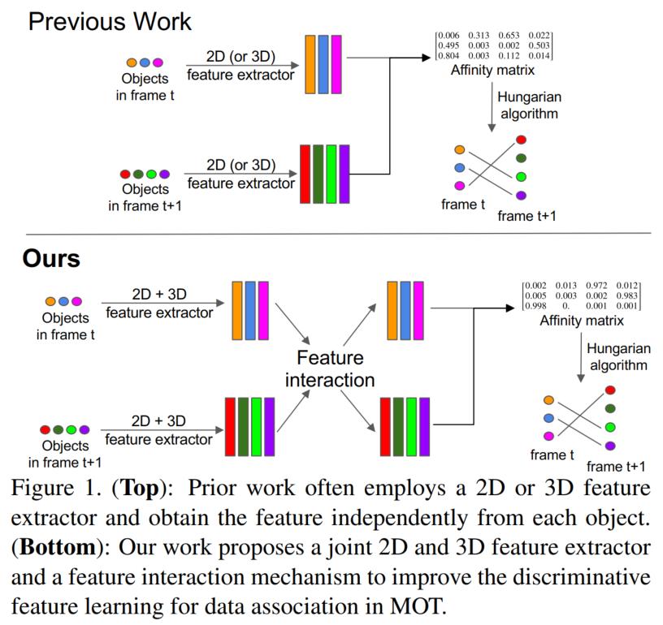

- 网络结构：用到了LSTM
    

<b> mmMOT (ICCV 2019) </b>

- tracking-by-detection；多模态融合（主要rgb+pcd）

- 摘要：在自动驾驶系统中，可靠性和准确性缺一不可。本文提出一个通用的传感器无关（sensor-agnostic）的多模态MOT框架，一方面，每个模态能独立工作，以此保证稳定性；另一方面，利用多模态信息融合模块，可以提升准确性。提出的mmMOT可以端到端训练，因此能联合优化单个模态的特征提取，和跨模态的邻接估计（adjacency estimator）。号称是第一个把点云的深度表达，用到数据关联过程中的工作。在KITTI benchmark上取得了SOTA。

- 关于稳定性和可靠性
    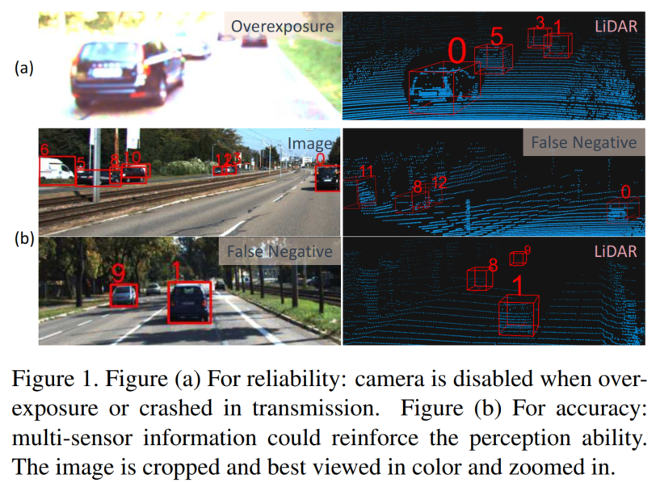

- 网络结构：主要就是融合rgb和雷达点云
    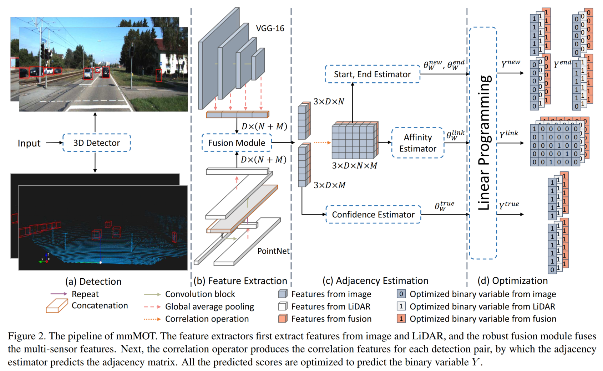

<b> ComplexYOLO (arxiv 2018) </b>

- 摘要：本文把3D点云转换为2D BEV鸟瞰图，然后在2D目标检测器YOLOv2的基础上，提出了E-RPN模块用于候选生成，在笛卡尔空间估计多类目标的3D boxes。

- 点云预处理：将单帧3D点云转换成一张鸟瞰图RGB-map，覆盖传感器正前方ROI区域（80米 x 40米）高度3米以内，2D grid map的大小是1024x512，所以点云被投影和离散化到8cm左右的网格中。区别与图片中的RGB，这里三通道RGB-map分别对应点云的高度信息，强度信息，和密度信息。

- Pipeline：采用YOLOv2的Darknet19对RGB-map进行特征提取，并回归出目标的相对中心点$t_x$，$t_y$，相对宽高$t_w$，$t_l$，复数角$t_{im}$，$t_{re}$，以及类别$p_0,...,p_n$，目标朝向角可使用$\arctan(t_{im}, t_{re})$求出，采用复角回归的好处是，可避免歧义性。
    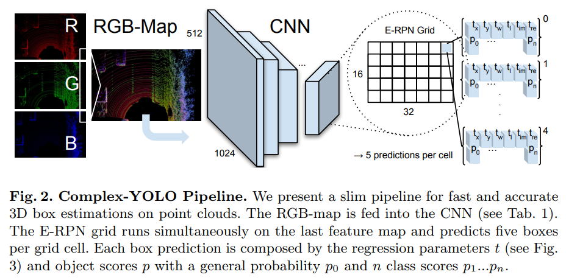

- 方案可视化
    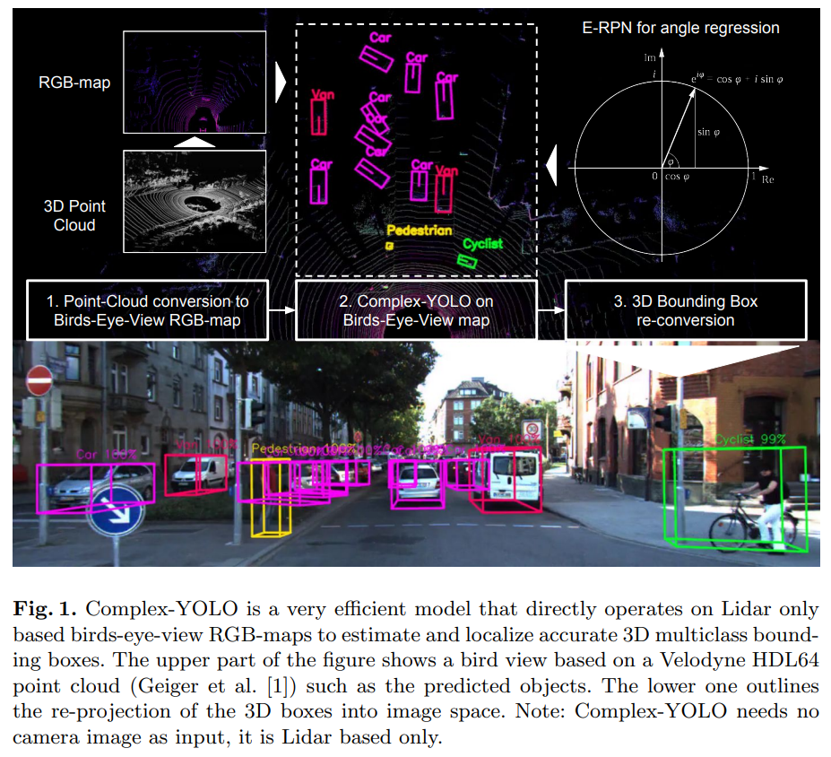

- 评价：1.很多点云检测网络在其预处理部分需要消耗大量时间，本文也不例外，虽然网络的前向传播时效性比较好（或者升级到v5版本），但是对点云的预处理部分仍然拖累整体耗时；2.采用鸟瞰图形式的检测，由于点云近密远稀的特征，限制了其有效检测距离，所以本文只在40M以内的效果比较好；

<b> ComplexerYOLO (CVPRW 2019) </b>

- 摘要：针对自动驾驶场景，融合3D detector和语义分割；提出“尺度-旋转-平移”的得分度量（SRTs metric）；构建了在线的多目标特征跟踪；该方法在KITTI上展示了SOTA效果，并且实时运行，号称是第一个融合视觉语义和3D物体检测的工作。

- 点云预处理：大概是把点云按一定分辨率体素化，然后将rgb图片的语义分类结果反投影到体素中，得到体素化的语义点云（voxelized semantic point cloud）。

- SRTs：训练时通常用IoU比较预测和真值，若2个框大小和位置相同，但朝向相反，此时IoU=1表示完美匹配，但实际是很不好的，于是提出SRTs，分别考虑缩放、旋转、平移三者得分，再加权平均得最终分数。

-  Labeled Multi-Bernoulli Filter (LMB) Random Finite Sets (RFS) 用于多目标跟踪，暂不深究；
- 方案可视化
    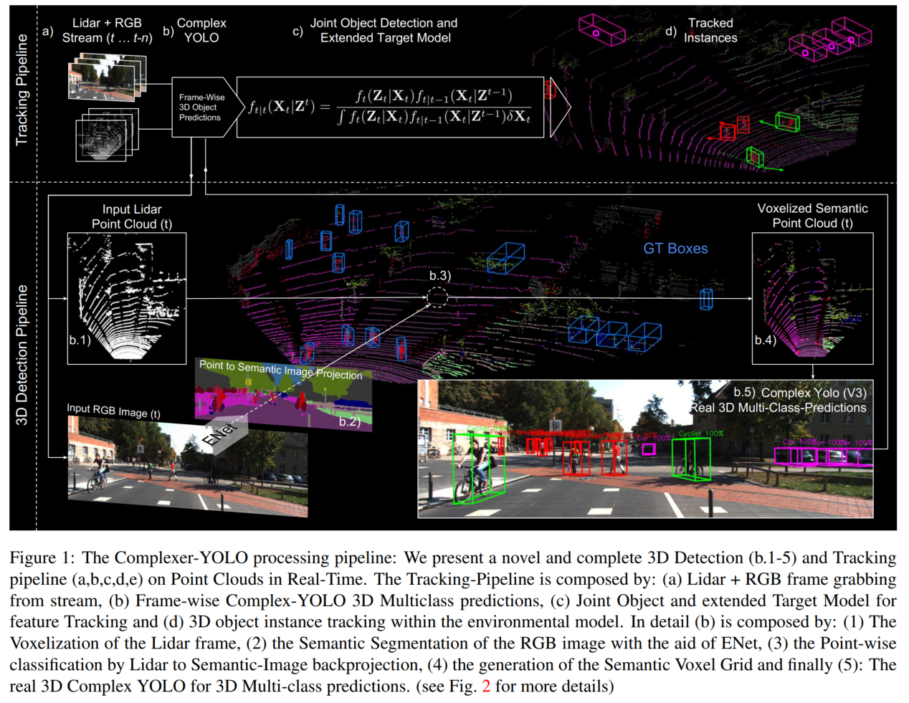
- 整体架构
    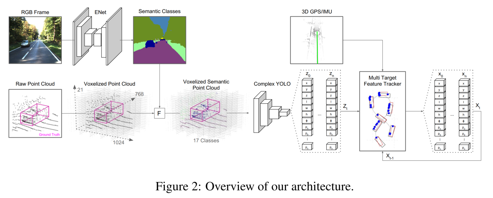

<b> DSM (ICRA 2018) </b>

- DSM: Deep Structure Model

- 摘要：tracking by detection；利用rgb图片和lidar点云，生成离散的3D轨迹，然后用线性规划（带线性约束的优化问题）生成最终的跟踪结果；整体架构包括三个CNN模型，即detectionnet，matchingnet和scoringnet。同样是在KITTI上评估。

- 关于detection模块，先采用MV3D检测器生成带方向的3D bbox proposal，再用VGG16来预测proposal的true/false，然后将3D bbox投影到图像上，提取对应的image patch，送入卷积网络生成检测得分。

- 整体结构
    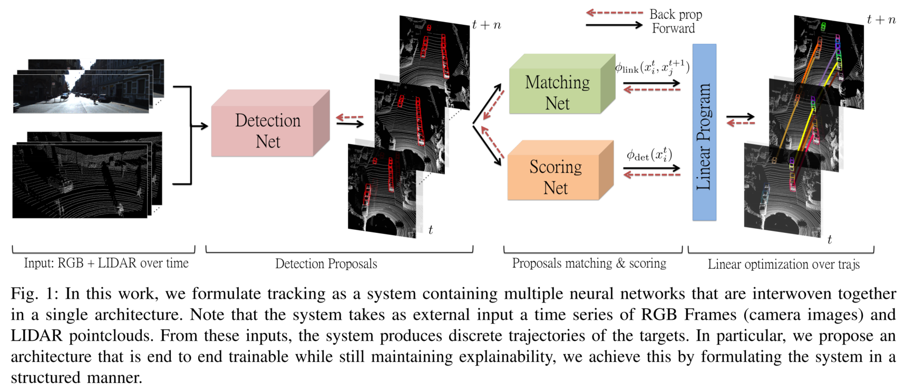
- 得分和匹配：上标带det，表示使用或丢弃该检测的代价；上标带link，表示连接/不连接xi和xj的代价；上标带new，表示启动一个新的轨迹，end表示结束一个现存的轨迹。
    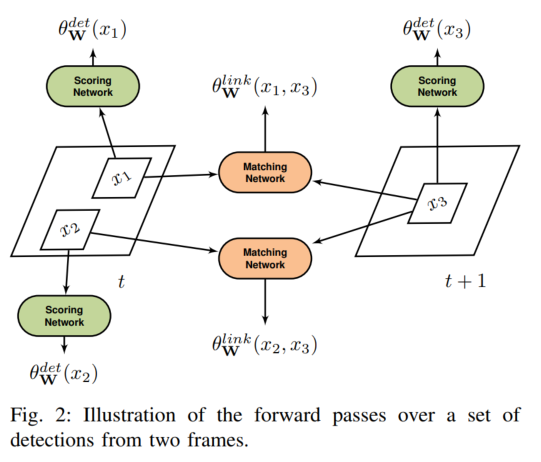

---

<b> FaF (CVPR 2018) 关注！ </b>

- `也许可借鉴的思路`：输入多帧，预测多帧，然后将当前预测和历史预测进行平均（或其它更高级融合）！
- From博客：哈哈哈，这篇文章的第一个特色是名字长，第二个特色是不开源！（文中很多细节缺失，可能涉及公司实现保密？！）
- 摘要：作者认为，当前的自动驾驶方法将问题分成了四步：检测、目标跟踪、运动预测、运动规划。但是现在的主流方法通常将这四个步骤作为四个独立的模块，这样会导致下游任务无法纠正上游任务的错误。所以该文中提出了一种结合检测、追踪、预测三个模块的方法，整体结构是端到端的全卷积网络，可在30ms内完成三个任务。

- 数据预处理-体素表达：将3D点云体素化，每个voxel根据occupancy的情况binary取值；然后直接把height维度(z-dim)作为channel维度，执行2D卷积；这里不采用3D卷积，因为点云的稀疏性，造成体素的稀疏性，3Dconv会造成计算资源浪费。（提一下：MV3D是另一篇结合图像和点云做3D检测的工作，它也将3D数据投影到2D，具体是在x,y平面量化，然后计算高度信息z的手工特征）

- 数据预处理-添加时序信息：首先执行一次坐标变换，将前几帧的数据坐标变换到当前坐标系下(因为考虑的是自动驾驶任务，传感器是在移动的，所以会有一个坐标变换)。沿着时间维度将多帧数据拼接在一起就可以凑成一个4D的张量，也就是后续任务的输入。下面Fig.3中，作者将多帧数据拼接在一起形成了可视化界面，静态物体很好地对齐，动态物体产生"shadows"。【疑】到底怎么overlay multiple frames，这里每一帧都是3D tensor。
    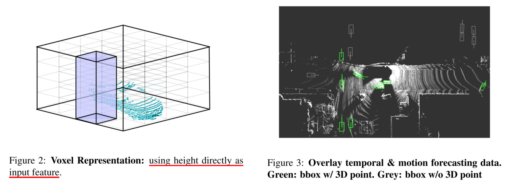

- 整体结构 
    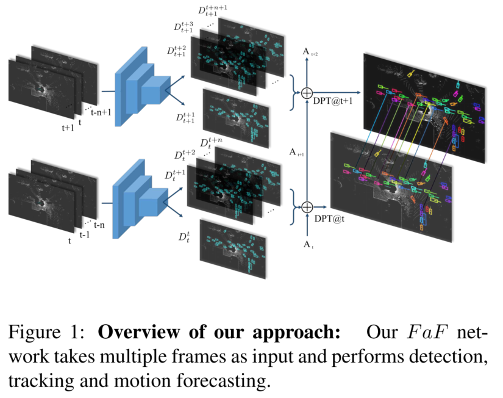

- 建模：作者抛弃了region proposals，直接预测Bouding box。针对多帧数据的融合，提出了两种融合方法，即Early Fusion和Late Fusion。其中，Early Fusion在第一层就进行信息聚合，所以他运行速度很快，首先在时间维度上使用核大小为n(与帧数一样)的1维卷积进行处理，将时间维度降为1，后面送入类似VGG16的网络提特征；Late Fusion逐渐汇聚不同帧之间的特征，这使得模型可以抓住高层次的特征，它首先做了一个分组卷积，即每帧数据做了一次2D卷积，也就是第一个箭头，然后这个4D的tensor做一个3D卷积(no padding)，也就是第一个黄色箭头。所以时间维度从5将到3，第二轮就只有三个蓝色方块了，再次进行分组卷积后，对tensor做了第二次3D卷积，时间维度就变成1了，这两步对应着图中的第二个小箭头和第二个黄色箭头。后面再进行多次卷积。（自：图示(b)中的3D卷积，时间维度上的kernel大小应该是3）
    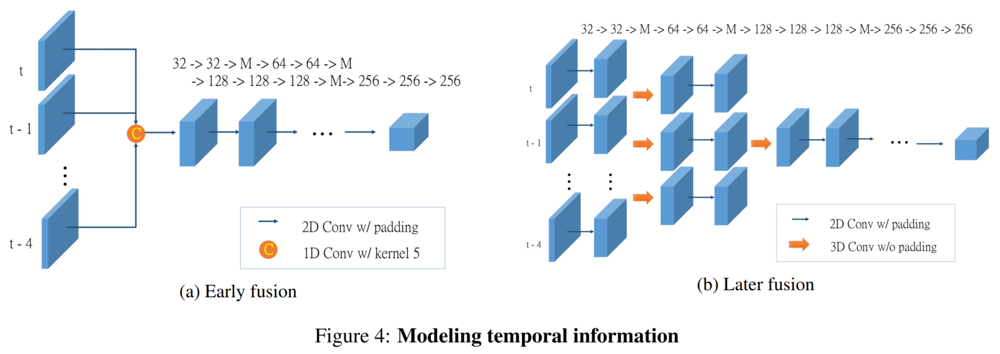

- 在Fig.4的最后，作者添加了两个卷积层分支，一个分支执行binary分类，判断是车的概率（注意FaF只检测车）；一个分支预测当前帧和未来n-1帧的bbox。这里做运动预测是可能的，因为模型的输入就是多帧信息！

- Decoding Tracklets：从前面可以看到，每一帧的数据都预测了n帧结果(自己的1帧，和向后的n-1帧)。换过来想，每帧数据同时拥有当前的预测和n-1个来自于以前的预测。作者将这些结果做了平均，作为当前帧被检测物体的Box。这一信息将在跟踪任务中物体出现遮挡等问题时提供强有力的信息。

<b> SC3DTracking (CVPR 2019) </b>

- 自：做单目标跟踪（要提供初始pose），仅仅在汽车类别上做了测试，对于其它类别如何？怕是悬...

- 摘要：本文提出了一种基于形状补全网络和孪生网络的单目标在线跟踪器，将model shape和candidate shape分别编码为紧凑的隐层表达，属于同一物体的表达，有更高的余弦相似度。作者发现3D目标跟踪和3D形状生成这两个任务可以互补。在KITTI上测试car 3D bbox，取得76.94%的成功率和81.38%的精度，形状补全带来3%的提升。**号称是第一个将siamese网络用于点云的工作**！
- Siamese Tracker: 输入点云序列，其中包括待跟踪的物体，并且在第一帧提供物体的3D bbox；在第t帧，一堆候选形状$\{x_c^t\}$被编码为隐向量$\{z_c^t\}$，并分别和模型形状$\hat{x}^t$的隐向量$\hat{z}^t$进行比较，最优的候选被选中，作为当前帧中的物体，同时，模型形状$\hat{x}^t$要相应更新。（注：$\hat{x}$是ground truth，是将所有帧中的该物体点云concat得到）
- 网络结构图
    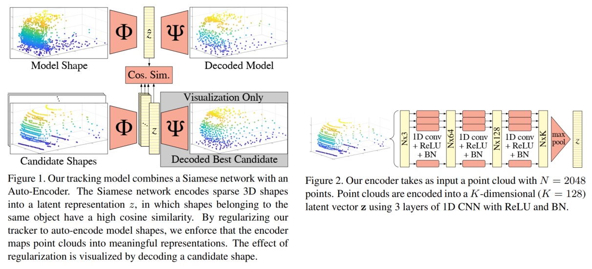
- 编解码器：借鉴这篇文章（[latent3Dpoints](http://proceedings.mlr.press/v80/achlioptas18a/achlioptas18a.pdf)），但编码器采用了更浅层的网络，模型参数量从140K降到25K；解码器由2个FC层构成，负责将128维的隐向量映射回$2048 \times 3$的点云；
- 损失函数：(A)跟踪损失，物体（直接看成汽车好了）的pose由三个参数刻画（3dof），即$(t_x,t_y,\alpha)$，Eq.(2)中的$\rho(\cdot)$是高斯函数（$\mu=0$, $\sigma=1$），用来软化正负样本之间的距离；最小化Eq.(2)，会促使编码器增大partial和complete形状之间的相似度。(B)补全损失，对应Eq.(3)，计算模型形状与其重构形状的chamfer距离。
    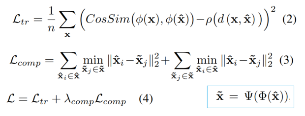

<b> P2B (CVPR 2020) </b>

- 摘要：本文将3D点云里面的目标跟踪，看作一个目标检测问题，主要使用了[VoteNet](https://arxiv.org/pdf/1904.09664.pdf)里面的2阶段投票技术；在单卡英伟达1080TI上可以达到40FPS。KITTI上测试，性能优于SC3DTracking。

- 关于VoteNet及其扩展版ImVoteNet，暂不记录于此，可参知乎讲解：[VoteNet](https://zhuanlan.zhihu.com/p/94355668)，[ImVoteNet](https://zhuanlan.zhihu.com/p/125754197)。

- 整体流程：(1) 模型有两个输入，即目标模版点云（target template）和搜索区域点云（search area），有一个输出，即目标模版点云在搜索区域点云中的3D bbox信息；(2) 整体分为两步，对照VoteNet，第一步得到seed point及其特征，每个种子点分别产生vote；第二步对vote的结果（比较靠近中心的一堆点），做基于fps和ball-query的聚类，再对每个cluster执行pointnet提特征并产生vote，最后挑出score最高的cluter产生的vote作为最终结果。同于VoteNet，第一次是“个体-seed”投票，得出靠谱的“组织-cluter”，第二次是“组织”投票。不同于VoteNet，P2B是做tracking，因此直接挑score最高的结果即可，而VoteNet是做检测，要基于NMS得出所有可能的目标位置。
- 流程图示：(1) Fig.2的左侧，核心思想是要把模板区域的种子特征，融入搜索区域的种子特征，即所谓“目标特定的特征增强”；(2) 具体地，考虑到种子点是无序的，于是提出Fig.4中的增强方案，核心是先broadcast堆叠，然后会对M1维度做max-pooling，这样就实现了对模板种子点的置换不变性；(3) Fig.2的右侧，对应“个体”和“集体”的2次投票。
    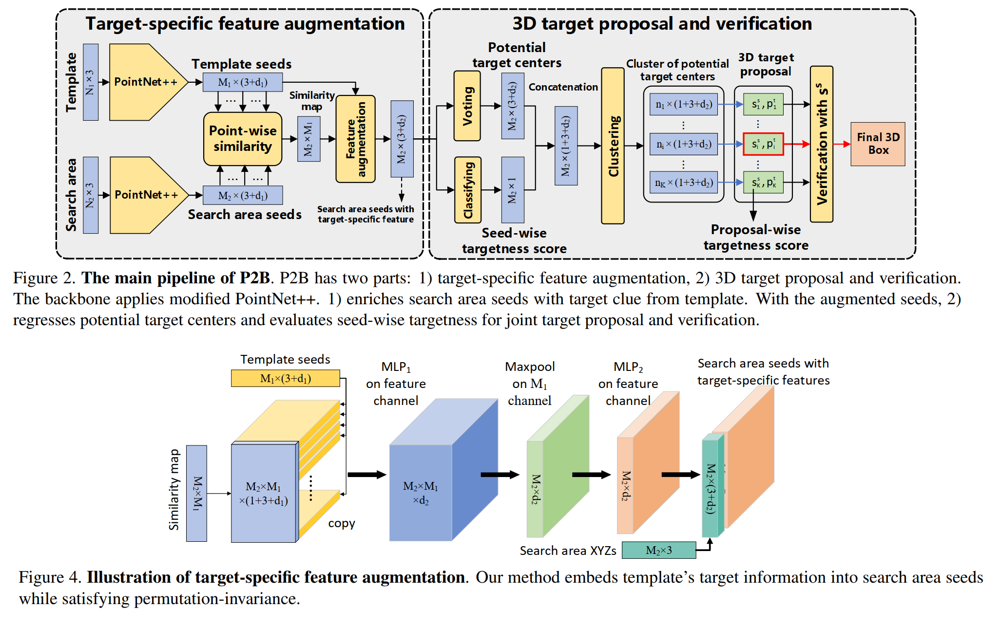

<b> PointTrackNet (IRAL 2020) </b>

- note: 端到端3D目标检测+跟踪，没有使用传统滤波算法，**直接预测逐点的关联位移，再取平均转为bbox的位移**（感觉是voting的思路），通过IoU+阈值进行关联。文中的`概率滤波也许能借鉴`。

- 摘要：作者称传统的跟踪方法使用滤波器（eg.卡尔曼滤波，粒子滤波）来预测物体在时序中的位置，这类方法对于极端的运动情况（eg.目标急刹和转向）不够鲁棒，因此提出PointTrackNet，它是一个端到端的3D目标检测和跟踪的网络，**输入是相邻的两帧点云**，输出是前景mask，3D bbox，逐点的跟踪关联位移。在KITTI上展现了SOTA效果。

- 网络结构：(1) 特征提取模块：输入是$N\times 3$的点云，基本沿用pointnet++的语义分割做法，提取点云特征，通过FC层回归出$N\times 2$的mask和$M$个bbox；(2) 关联模块：包含了一个概率滤波、两个SA层和一个关联头；所谓**概率滤波**，就是只保留前景概率最高的$N'$个点，随后在这$N'$个点上使用FPS和SA层进行特征提取，这里滤波+FPS的操作，作者取名**滤波FPS**，这样做可以尽量避免背景干扰；随后，为了将前后两帧的特征进行融合，对于前一帧的每个点，找到它在后一帧中最近的$K$个点，将他们的特征、欧式距离拼接起来，放入类似PointNet结构中学习逐点的跟踪关联位移；(3) 调优模块：一者由于上一步下采样了，所以需要恢复到滤波后的点云数量$N'$，二者要refine关联特征，最后也是输出逐点的关联位移；(4) 轨迹生成模块：对上一帧中的每一个Box，找到Box中的点，每个点都有一个预测位移，将这些值做平均，就得到了这个Box的预测位移值，然后计算它和当前帧中每一个Box的IoU，如果大于阈值，则认为是一个物体，就获得了该目标的轨迹。
    

- from blog online：这篇论文说是实现了端到端的目标识别和跟踪，但是网络的模块依然是先识别物体的位置信息，然后提取目标点云的信息送入网络配对。作者说这可以改善传统方法由于目标识别不准导致的算法退化，但这之中也没有什么反馈，第一步未识别到的物体也没有通过第二步的跟踪能再次识别，所以最终算法的准确度还是依赖于第一步能否检测到目标。另外，不同帧之间的同一物体应该是有几何上还有空间上的关联的。本文采用的目标相关完全是根据点的特征来判断的，相当于完全依赖深度学习算法。如果加上一些先验知识，例如相邻帧同一目标的位置不能突变，点云的相对位置也有相似，应该可以更好的提升精度。

 Prob3DMM-MOT (ICRA 2021) 

- 仅读摘要没细看
- copy摘要：Current SOTA follows the tracking-by-detection paradigm where existing tracks are associated with detected objects through some distance metric. **Key challenges** to increase tracking accuracy lie in data association and track life cycle
management... 1) we learn how to **fuse features** from 2D images and 3D LiDAR point
clouds to capture the appearance and geometric information of an object. 2) we propose to **learn a metric** that combines
the Mahalanobis and feature distances when comparing a track and a new detection in data association. 3) we propose to learn when to **initialize a track** from an unmatched object detection.
- copy From survey: 3D Kalman Filter with a constant linear and angular velocity model. Mahalanobis distance for data association process and co-variance matrices for the state prediction process.
- 算法流程
    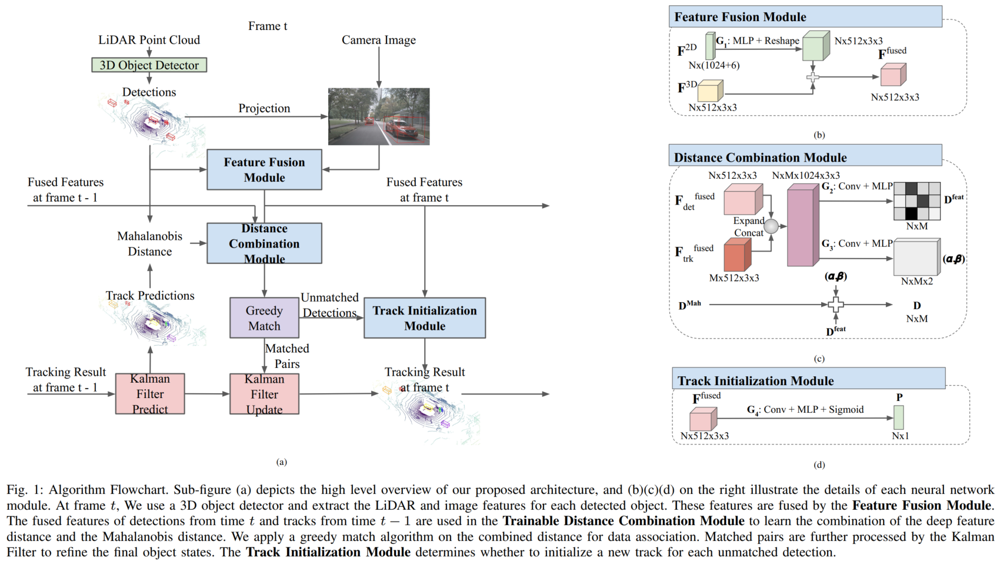

 AB3DMOT (arxiv 2020) 

- 仅读摘要没细看
- copy摘要：近来3D MOT关注系统准确性，忽视了实际应用的要素，比如计算复杂度/系统复杂性。本文提出一个简单的实时3D MOT系统。Our system first obtains 3D detections from a LiDAR point cloud. Then, a straightforward combination of
a 3D Kalman filter and the Hungarian algorithm is used for state estimation and data association. 此外，提出一个新的3D MOT评估工具，里面有3种metrics。虽然我们的方法只是对经典MOT模块的一个组合，但在KITTI和nuScenes上取得了SOTA，所提方法运行速度可以达到207FPS。

- copy From survey: as a compact baseline: pre-trained 3D object detector + 3D Kalman Filter with constant velocity model + Hungarian algorithm.

- 2D和3D MOT的比较
    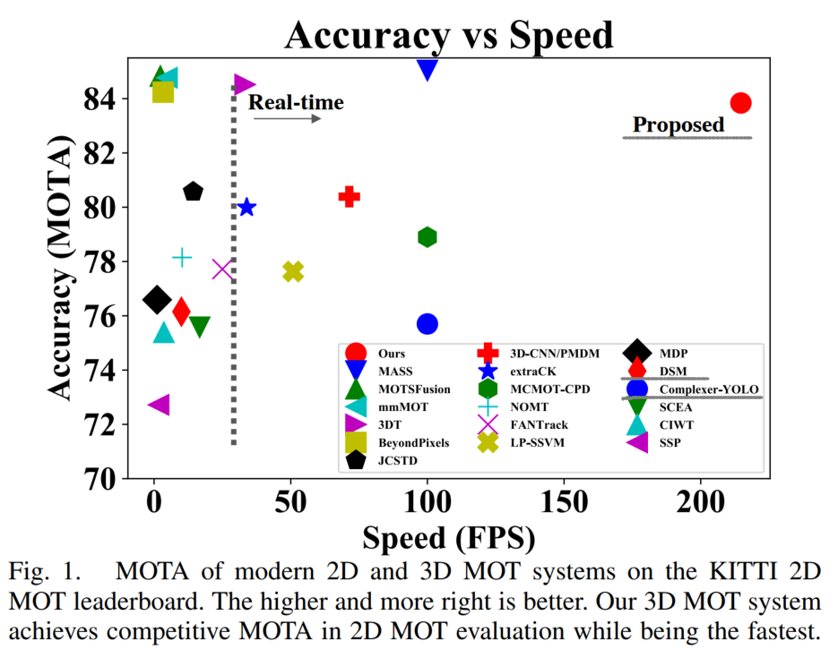

- 算法流程
    

 <b> CenterPoint (CVPR 2021) 关注！ </b> 

- 要点：1.使用点表达，简化3D检测任务；2.通过预测velocity和最近距离匹配，简化跟踪任务；3.通过第二阶段预测bbox的score来减少第一阶段产生的错误预测。

- 概述：2020年作者在arxiv公开了第一版CenterPoint，后续进一步将其扩充成一个两阶段的3D检测追踪模型，相比单阶段的CenterPoint，性能更佳，耗时更少。在第一阶段，使用关键点检测器(CenterNet)检测目标的中心点，并回归其检测框3D大小，3D朝向和速度。在第二阶段，设计了一个refinement模块，使用中心点的特征回归检测框的score并进行refine。CenterPoin使用标准的Lidar-based主干网络，比如VoxelNet和PointPillars。

- 算法流程图
    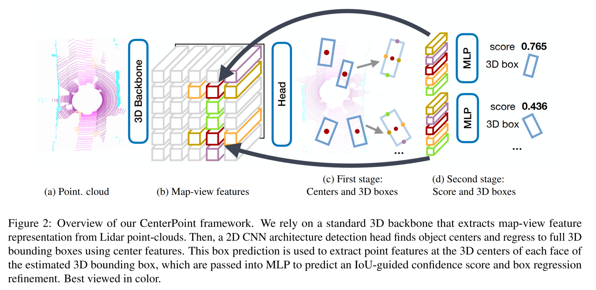

- 关于数据格式：作者沿用Pointpillars，Second，VoxelNet这些方法的输入，采用**BEV格式**，先将点云量化到体素或称regular bins，然后对于每个bin，用point-based网络提取里面所有点的特征并池化，大多计算量都耗在这里，最后主干网络输出的是map-view（鸟瞰图的另一种表述）的特征图$M\in \mathbb{R}^{W\times H\times F}$，然后，一阶段/两阶段的检测头，就可以基于特征图进行预测。

- Center heatmap head：该分支生成$K$个通道的热力图$\hat{Y}$，每个通道对应一个类别。制作热力图的gt时，要用高斯函数render一下，这样可以避免监督信息过于稀疏（算是常规操作了），里面高斯径向radius沿用CornerNet的设置（CenterNet中就是沿用CornerNet）。

- Regression heads：基于物体中心点的特征向量预测：2维的sub-voxel位置校正（这个类比2D CenterNet中的offset），1维的height-above-ground，3维的bbox size，以及用$(sin(\alpha), cos(\alpha))$表示2维的偏航角度，它们各自都对应一个head。

- Velocity head and tracking：预测2维的velocity，这个比较特殊，它要求输入当前帧和上一帧的map-view，然后预测两帧之间的物体位置的差异。推理阶段，可以将当前帧的位置预测，通过加上负的velocity得到上一帧的“代理点”（自己起的名字），然后基于贪心策略，基于最近距离匹配。

- Two-Stage CenterPoint：物体中心点的特征向量可能并没有充分的信息，来准确预测前述所有属性，于是引入第二阶段的调优，将前面预测的3D bbox的每个面的中心点的特征向量拿出来，concat起来输入MLP，预测类别无关的置信度得分和bbox refinement。由于bbox的中心，顶面和底面在map-view下对应同一个点，所以实际考虑了5个中心点（参见网络结构图示），中心点的特征从特征图里基于双线性插值得到。

 <b> CenterTrack (ECCV 2020) </b> 

- 摘要：现今跟踪领域的主导方案是先进行目标检测，然后做时序上的关联，即tracking-by-detection。本文提出一个同时做检测和跟踪的算法，更简单，更快速，更准确，是online算法（不需要获取未来帧的信息）。在MOT17上以22FPS取得67.8%的MOTA，在KITTI上以15FPS取得89.4%的MOTA。CenterTrack可以容易地扩展到单目3D跟踪，通过回归额外的3D属性，在nuScenes 3D跟踪benchmark上以28FPS取得28.3%的AMOTA@0.2。

- 算法流程 CenterTrack_net.png
    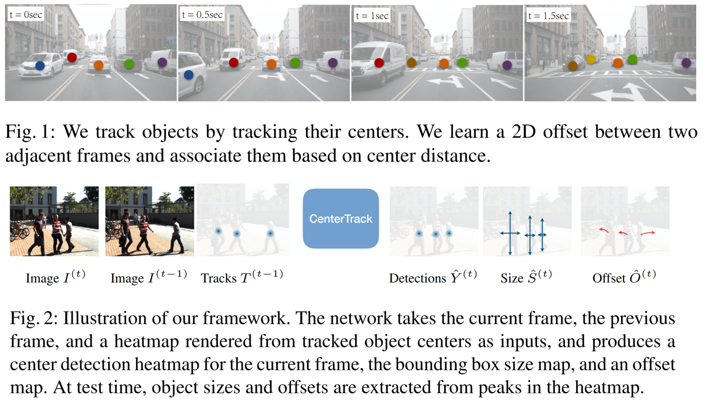

- 网络结构（From博客）
    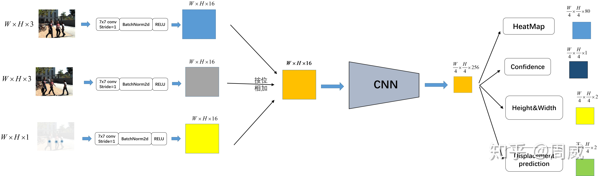

 <b> TP-AE (ICRA 2022) 关注！ </b> 

- 解决遮挡下的对称/低纹理物体的位姿估计；号称优于CosyPose, PoseRBPF；
- **摘要**：This paper focuses on the instance-level 6D pose tracking problem with a symmetric and textureless object under occlusion. The proposed TP-AE framework consists of a prediction step and a temporally primed pose estimation step. ... test on T-LESS dataset while running in real-time at 26 FPS.

- **网络结构** (1) 在每个time step，先验位姿估计模块，将历史位姿估计序列输入GRU-based网络，生成当前帧的位姿先验；(2) 预测的位姿先验，和当前帧的RGB-D数据，一并输入pose-image融合模块，生成RGB-Cloud pair，接着送入3个分支，分别预测物体旋转、平移和可见部分。
    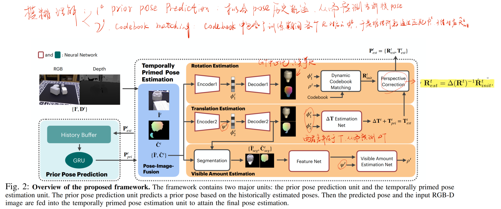

 ROFT (arxiv 2021) 

- 摘要：We introduce ROFT, a Kalman filtering approach for 6D object pose and velocity tracking from a stream of RGB-D images. By leveraging real-time optical flow, ROFT synchronizes delayed outputs of low frame rate CNN (for instance segmentation and 6D pose estimation) with the RGB-D input stream to
achieve fast and precise 6D object pose and velocity tracking. ... test on newly introduced Fast-YCB, and HO-3D.

- 网络结构：暂跳过
    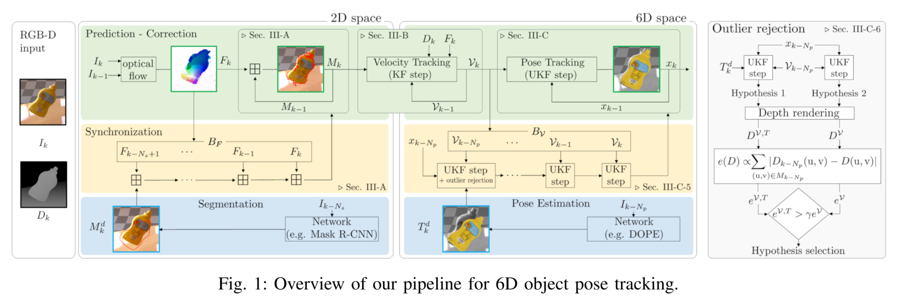

...

