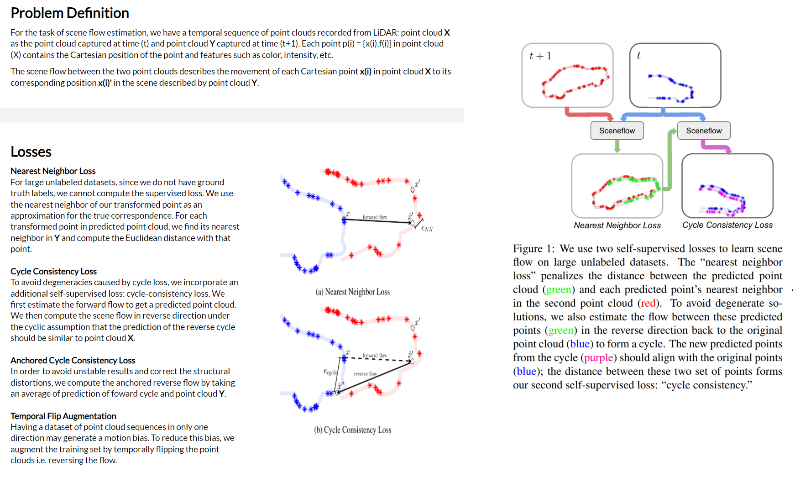

## Scene Flow Estimation

- **Just Go with the Flow** Himangi Mittal (CMU), Just Go with the Flow: Self-Supervised Scene Flow Estimation. [[CVPR 2020](http://openaccess.thecvf.com/content_CVPR_2020/papers/Mittal_Just_Go_With_the_Flow_Self-Supervised_Scene_Flow_Estimation_CVPR_2020_paper.pdf)] [[page](https://just-go-with-the-flow.github.io/)] [cite 64]

- 看了两个有关视频理解的blog: [1](https://zhuanlan.zhihu.com/p/102951950), [2](https://zhuanlan.zhihu.com/p/180496576)

- **--** [] [] [cite ]

- - -

## Paper notes

 <b> Just Go with the Flow </b> 

- **摘要**：Scene flow allows autonomous systems to reason about the non-rigid motion of multiple independent objects. We present a method of training scene flow that uses two self-supervised losses,
based on nearest neighbors and cycle consistency.

- **整体介绍**
    

 <b> - </b> 

- pose

- 摘要：

- 算法架构：
    

